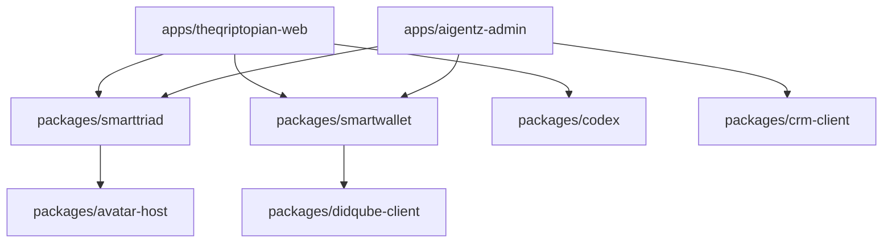
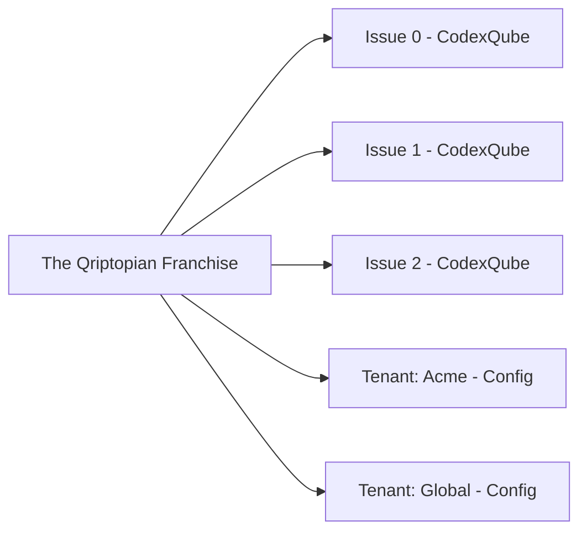
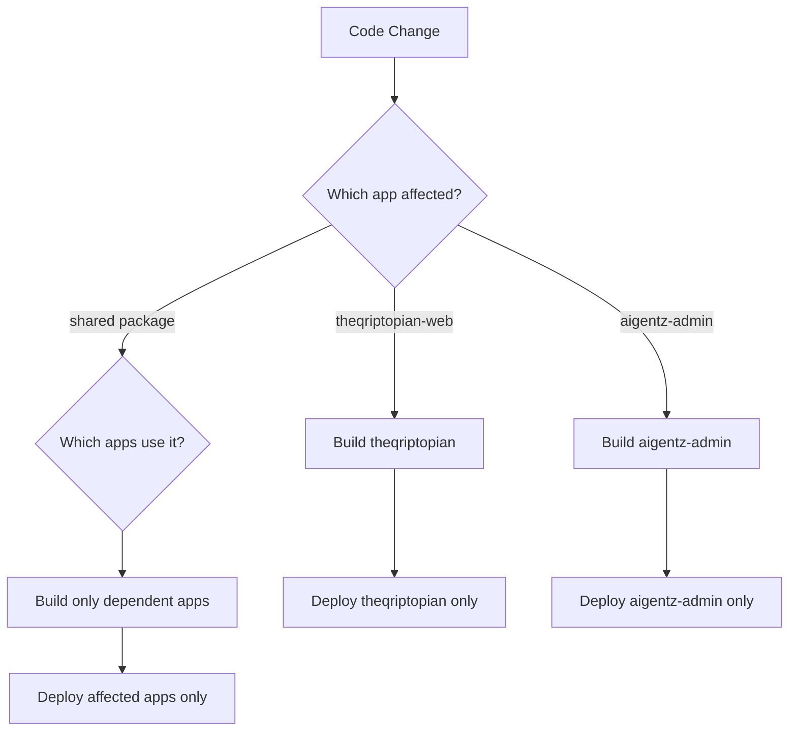

# AgentiQ Monorepo & CI/CD Design: Decoupled Deployment Architecture

**CRITICAL PRINCIPLE**: Monorepo ≠ Monolith. Changes to franchises/tenants MUST NOT require estate-wide redeployments.

## Table of Contents
1. [Objectives](#objectives)
2. [Repository Structure](#repository-structure)
3. [Dependency Rules](#dependency-rules)
4. [Issues vs Tenants](#issues-vs-tenants)
5. [CI/CD Strategy](#cicd-strategy)
6. [Change Scenarios](#change-scenarios)
7. [Governance Rules](#governance-rules)

---

## 1. Objectives

We're using a monorepo for AgentiQ / AigentZ to achieve:

### ✅ Benefits
- **Shared primitives** (SmartTriad, SmartWallet, Codex, DiDQube, CRM, etc)
- **Consistent tooling** and patterns
- **Easier reuse** between franchises (The Qriptopian, Qriptopia, MoneyPenny, etc)

### ❌ Anti-patterns to Avoid
- **Estate-wide redeploys** every time a single franchise changes
- **Thick platform deployments** blocked by thin client tweaks (and vice versa)
- **Hidden coupling** between apps

### 🎯 Target State
- You can change a franchise or tenant **without redeploying AigentZ**
- You can evolve core packages **without forcing immediate redeploys everywhere**

---

## 2. Repository Structure

### 2.1 High-Level Layout

```
agentiq-monorepo/
  apps/                    # ← Independently deployable artifacts
    aigentz-admin/         # Thick orchestration + admin
    theqriptopian-web/     # The Qriptopian franchise thin client
    qriptopia-web/         # Qriptopia/metaKnyts franchise
    moneypenny-web/        # MoneyPenny HFT/DeFi franchise
    ...                    # Other franchise or internal apps

  packages/                # ← Versioned libraries (non-deployable)
    smarttriad/            # Smart menu + drawers + layouts
    smartwallet/           # Shared wallet UI + logic
    codex/                 # CodexQube models + helpers
    didqube-client/        # DIDQube / persona client
    rqh-client/            # ReputationHub client
    crm-client/            # AgentiQ CRM / PoKW client
    x402-client/           # x402 flows, DVN integration
    agentiq-sdk/           # A2A / AA-API client
    qubebase-sdk/          # QubeBase client
    avatar-host/           # Global metaAvatar / iframe host
    ui/                    # Shared UI components (if needed)
```

### 2.2 Principles

| Layer | Purpose | Deployment |
|-------|---------|------------|
| **apps/*** | Deployable applications | Own artifact, own URL/host |
| **packages/*** | Shared libraries | No direct deployment, consumed by apps |

### 2.3 Dependency Flow



---

## 3. Dependency Rules

### 3.1 Allowed Dependencies

| From | To | Status |
|------|----|----|
| apps/* | packages/* | ✅ **Allowed** |
| packages/* | packages/* | ✅ **Allowed** (carefully managed) |
| apps/* | apps/* | ❌ **FORBIDDEN** |

**Critical**: No app imports another app's code at runtime.

### 3.2 Versioning & Stability

Even inside a monorepo, treat `packages/*` as **versioned, stable libraries**:

#### Per-App Version Pinning
```json
// apps/theqriptopian-web/package.json
{
  "dependencies": {
    "@agentiq/smarttriad": "1.2.0",
    "@agentiq/smartwallet": "1.1.0",
    "@agentiq/codex": "1.0.0"
  }
}
```

```json
// apps/aigentz-admin/package.json
{
  "dependencies": {
    "@agentiq/smarttriad": "1.1.0",  // ← Can stay on older version
    "@agentiq/smartwallet": "1.1.0",
    "@agentiq/crm-client": "2.0.0"
  }
}
```

#### API Stability Rules
- **Additive changes** are preferred (new props, new functions)
- **Breaking changes** must follow semantic versioning
- Apps only redeploy when:
  - Their own code changes, OR
  - You decide to bump their shared package versions

---

## 4. Issues vs Tenants (CRITICAL DISTINCTION)

### 4.1 Issues (Content Versions)

**Example**: The Qriptopian Issue 0, 1, 2

| Concept | Implementation |
|---------|----------------|
| **Franchise** | ONE app (`apps/theqriptopian-web`) |
| **Issue** | CodexQube data in QubeBase |
| **Adding Issue 1** | New data entry → **ZERO deployments** |
| **Archive** | Codex drawer + SmartWallet Library |

```typescript
// Issues are data, not apps or tenants
const codexIssue0: CodexQube = {
  codexId: "theqriptopian-issue-0",
  title: "The Qriptopian - Issue 0",
  sections: [...],
  articles: [...],
  // ...
};

const codexIssue1: CodexQube = {
  codexId: "theqriptopian-issue-1",
  title: "The Qriptopian - Issue 1",
  sections: [...],
  articles: [...],
  // ...
};
```

### 4.2 Tenants (Branded Editions)

**Example**: "The Qriptopian – Acme Edition", "The Qriptopian – Global"

| Concept | Implementation |
|---------|----------------|
| **Franchise** | Same `apps/theqriptopian-web` |
| **Tenant** | Different `tenant_id` |
| **Differentiation** | QubeBase config (branding, features, Codex sets) |
| **Adding Tenant** | Config + DNS mapping → **ZERO deployments** |

```typescript
// Tenants are config, not apps
const tenantConfig = {
  tenantId: "acme",
  branding: {
    logo: "acme-logo.png",
    colors: { primary: "#ff0000" }
  },
  features: {
    enabledDrawers: ["article", "wallet", "agents"],
    codexSets: ["theqriptopian-issue-0", "theqriptopian-issue-1", "acme-exclusive-issue"]
  }
};
```

### 4.3 Key Distinction



**Issues** = Content snapshots (data)  
**Tenants** = Branded deployments (config)  
**Franchise** = Single deployable app

---

## 5. CI/CD Strategy

### 5.1 Per-App Builds and Deploys

```yaml
# .github/workflows/theqriptopian.yml
name: Deploy The Qriptopian
on:
  push:
    paths:
      - 'apps/theqriptopian-web/**'
      - 'packages/smarttriad/**'
      - 'packages/smartwallet/**'
      - 'packages/codex/**'

jobs:
  deploy:
    runs-on: ubuntu-latest
    steps:
      - uses: actions/checkout@v3
      - name: Detect affected apps
        run: pnpm nx affected:apps
      - name: Build theqriptopian-web
        run: pnpm nx build theqriptopian-web
      - name: Deploy
        run: pnpm nx deploy theqriptopian-web
```

### 5.2 Change Detection

Use workspace-aware tools:
- **Nx**: `nx affected:apps`
- **Turborepo**: `turbo run build --filter=...[HEAD^1]`
- **pnpm workspaces**: Manual path detection in CI

### 5.3 Deployment Architecture



### 5.4 Backend Services

AigentZ core services (DIDQube, RQH, CRM, x402, SmartTriad service, QubeBase, etc.) should be:

- **Long-lived services** with versioned APIs (`/v1/`, `/v2/`)
- **Backwards-compatible** changes wherever possible
- **Data-driven** for franchise/tenant-specific behavior:
  - Config in QubeBase
  - CodexQubes
  - SmartTriad configs

**Result**: Adding new issue/gating rules/tenant = data/config change, **no thick platform deployment**.

---

## 6. Change Scenarios

### 6.1 Change Scenarios Matrix

| Scenario | Files Changed | Deployments Required |
|----------|--------------|---------------------|
| **Franchise UX tweak** | `apps/theqriptopian-web/**` | ✅ `theqriptopian-web` only |
| **Add Issue 1** | QubeBase data (CodexQube) | ❌ None (just data) |
| **New tenant** | Config + DNS | ❌ None (just config) |
| **New SmartTriad feature** | `packages/smarttriad/**` | ✅ Opt-in apps only |
| **AigentZ protocol upgrade** | Core services + clients | ✅ Core + opt-in apps |

### 6.2 Detailed Examples

#### Example 1: Change The Qriptopian Layout

**Change**: Redesign The Qriptopian hero + drawers, tweak SmartTriad config, adjust wallet styling.

**Files touched**:
```
apps/theqriptopian-web/
  src/pages/Index.tsx
  src/components/Hero.tsx
  smartTriad.config.ts
packages/ui/
  Button.tsx (minor styling update)
```

**CI/CD Action**:
```bash
✅ Build & deploy: theqriptopian-web
❌ NO AigentZ redeploy
```

---

#### Example 2: Add or Modify Issue 1

**Change**: Add Issue 1, or change pricing/access rules for content in Issue 0.

**Files touched**:
```
QubeBase:
  - New CodexQube: theqriptopian-issue-1
  - SmartTriad config update (admin UI)
```

**CI/CD Action**:
```bash
❌ NO deploy at all (data/config only)
✅ Optional: If UI changes to surface archive, deploy theqriptopian-web only
```

---

#### Example 3: Add New Tenant

**Change**: Create "The Qriptopian – Acme Edition" tenant.

**Files touched**:
```
QubeBase:
  - Tenant config (branding, domain, features)
  - DNS / reverse proxy mapping (new subdomain → same app)
```

**CI/CD Action**:
```bash
❌ NO code change
❌ NO app or AigentZ redeploy
```

---

#### Example 4: Extend SmartTriad with New Primitive

**Change**: Introduce new smart content card type or new wallet section.

**Files touched**:
```
packages/smarttriad/
  SmartContentCard.tsx
  types.ts
packages/smartwallet/
  LibraryTab.tsx
```

**Process**:
1. Implement change as **backward-compatible** addition
2. Bump library version (`1.2.0` → `1.3.0`)
3. Explicitly bump affected apps:
   ```bash
   cd apps/theqriptopian-web
   pnpm update @agentiq/smarttriad@1.3.0
   ```

**CI/CD Action**:
```bash
✅ Build & deploy: apps with bumped deps
❌ NO forced redeploy for unaffected apps
```

---

#### Example 5: Evolve AigentZ Core (Protocol Change)

**Change**: New DiDQube mode, new RQH scoring schema, new x402 payment type.

**Files touched**:
```
AigentZ core services
packages/didqube-client/
packages/rqh-client/
packages/x402-client/
```

**Process**:
1. Add new endpoints/fields; **keep existing endpoints stable**
2. Bump clients
3. Each app that adopts the new feature upgrades explicitly

**CI/CD Action**:
```bash
✅ Deploy: Core services
✅ Deploy: Apps that intentionally upgrade
❌ NO automatic redeploy of every franchise
```

---

## 7. Governance Rules

### 7.1 TL;DR for Contributors

1. **Apps** live under `apps/` and are independently deployable.
   - Don't make apps depend on each other.

2. **Shared logic** lives under `packages/` and must be stable.
   - New features → additive where possible
   - Breaking changes → versioned

3. **Issues** are CodexQubes, not tenants.
   - Don't create new apps for new issues
   - Treat issues as data for a franchise

4. **Tenants** = config + data, not new apps.
   - Use `tenant_id`, QubeBase config, theming, and Codex filters

5. **CI/CD** should:
   - Detect per-app changes
   - Build and deploy only impacted apps
   - Keep backend services separately deployable

6. **When in doubt**:
   - Prefer data/config + Codex + SmartTriad over code changes
   - Prefer updating a shared package over copy-pasting logic into an app

### 7.2 Code Review Checklist

Before merging any PR, verify:

- [ ] No `apps/* → apps/*` imports
- [ ] Shared package changes are backward-compatible OR properly versioned
- [ ] New features are additive (don't break existing apps)
- [ ] CI/CD only rebuilds affected apps
- [ ] Issues are implemented as CodexQubes (data), not new apps
- [ ] Tenants are implemented as config, not new apps
- [ ] Environment variables follow naming conventions
- [ ] TypeScript compilation passes (`npx tsc --noEmit`)

### 7.3 Escalation

If you encounter:
- A change that requires estate-wide redeploy
- Breaking changes to core packages
- Need for new app when tenant/issue would suffice

**→ Escalate to architecture review before proceeding**

---

## Appendix A: Tooling Setup

### A.1 Recommended Tools

- **Monorepo**: pnpm workspaces OR Nx OR Turborepo
- **CI/CD**: GitHub Actions with affected detection
- **Package Management**: pnpm (performance + workspace support)
- **Build Cache**: Turborepo cache OR Nx cache
- **Version Management**: Changesets (for package versioning)

### A.2 Initial Setup Commands

```bash
# Install pnpm
npm install -g pnpm

# Initialize workspace
pnpm init

# Create workspace config
cat > pnpm-workspace.yaml << EOF
packages:
  - 'apps/*'
  - 'packages/*'
EOF

# Install dependencies
pnpm install

# Build all packages
pnpm -r build

# Run specific app
pnpm --filter theqriptopian-web dev
```

---

## Appendix B: Migration Checklist

When migrating existing apps to monorepo:

- [ ] Move app to `apps/<franchise-name>`
- [ ] Update `package.json` with workspace dependencies
- [ ] Extract shared code to `packages/*`
- [ ] Set up independent CI/CD pipeline
- [ ] Configure build tooling (Vite/Next.js/etc)
- [ ] Update environment variable management
- [ ] Test independent deployment
- [ ] Document app-specific setup in app README

---

## Document Metadata

- **Version**: 1.0.0
- **Last Updated**: December 7, 2025
- **Authors**: AgentiQ Architecture Team
- **Status**: Active
- **Review Cycle**: Quarterly

**Enforcement**: This architecture MUST be preserved across all development. Violations create deployment coupling and estate-wide bloat.
