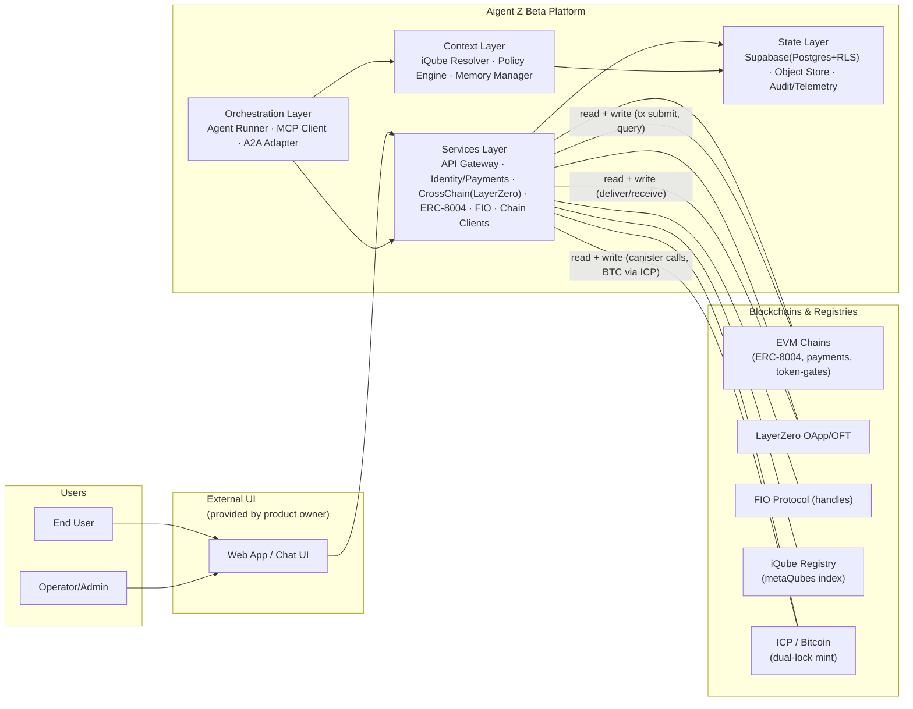
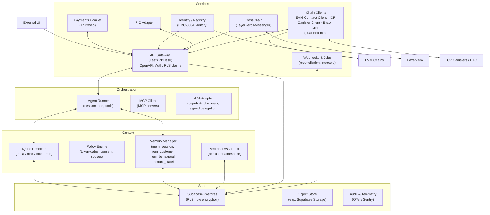
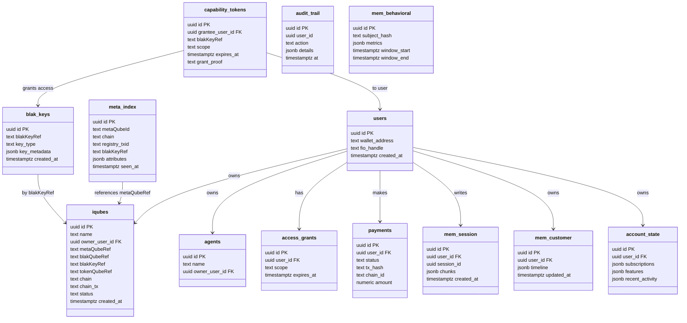
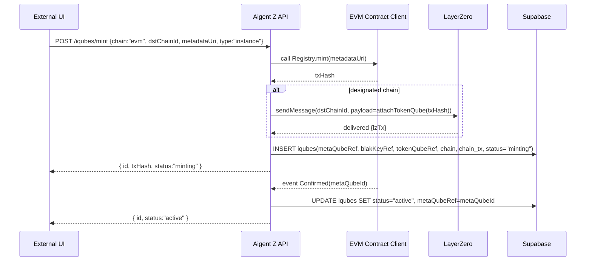
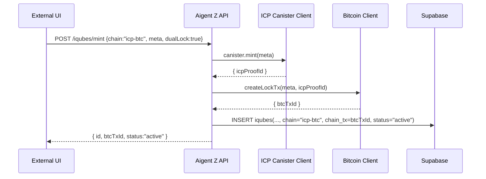
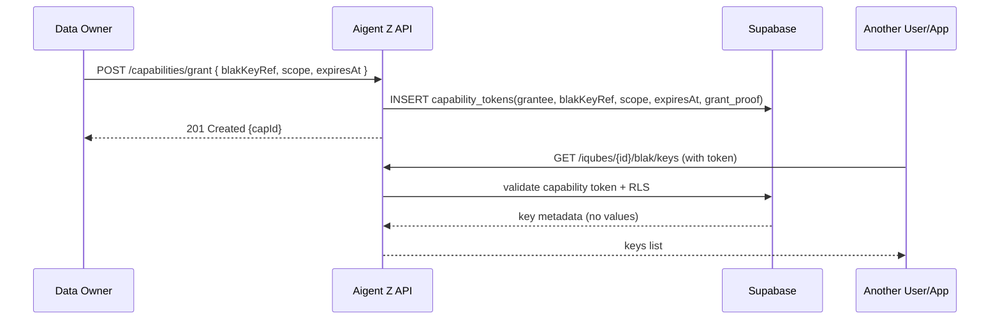

# Aigent Z Beta — Architecture (Updated for Direct Chain Writes & BlakQube Key Visibility)
_Last updated: 2025-09-09_

This update makes two major changes:
1. **Direct chain writes from the API**: the Services layer now includes **Chain Clients** that submit on-chain transactions (EVM contracts, LayerZero messages, ICP canister calls, and Bitcoin tx via the ICP pathway) directly from the backend.
2. **Global metaQube visibility + blakQube keys**: the application maintains a full index of **all metaQubes** (templates and instances) and can see **blakQube keys (metadata/handles)** for discovery and policy, while never storing or exposing **blakQube values** unless a user grants a explicit capability token.

## C4-Context

## C4-Container

## Data Model changes (ERD)
- New columns on `iqubes`: `blakKeyRef`, `chain`, `chain_tx`.
- New tables: `blak_keys` (public key metadata only), `capability_tokens` (time-boxed decrypt/share grants).
- `meta_index` now includes `blakKeyRef` so the app can discover keys (not values) for all metaQubes.

## Key sequences

### EVM mint with optional LayerZero to designated chain

### ICP/Bitcoin dual-lock mint (21 Sats)

### Share a blakQube key (capability token)

## Security & Privacy
- **Values never stored**: blakQube payloads are not persisted in app DB; only pointers and **public key metadata** live in `blak_keys` / `meta_index`.
- **Capability tokens**: decrypt rights are granted via signed, time-boxed tokens recorded in `capability_tokens`; RLS + signature verification required on read.
- **Managed key material**: server-side signing keys (for registry writes, relays, or canister identities) must be held in HSM/KMS; user-affecting txs use user signatures or a relayer with explicit consent.
- **Audit**: all on-chain write attempts and capability grants are recorded in `audit_trail` with purpose strings.
