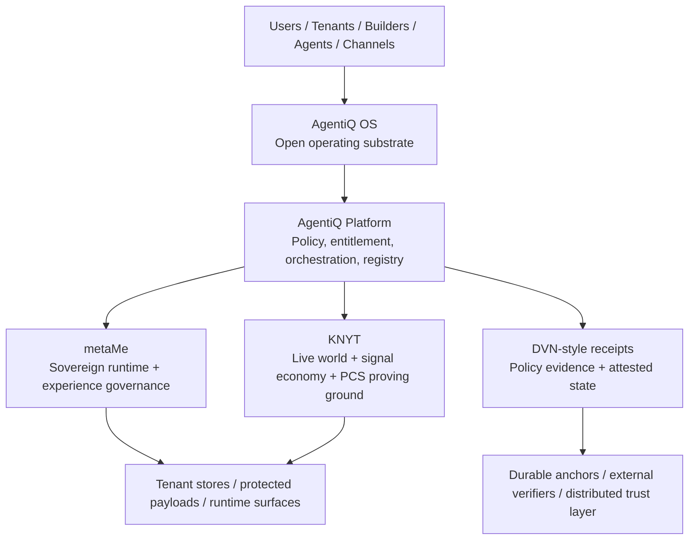
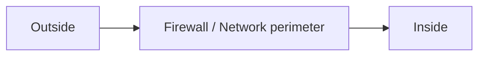
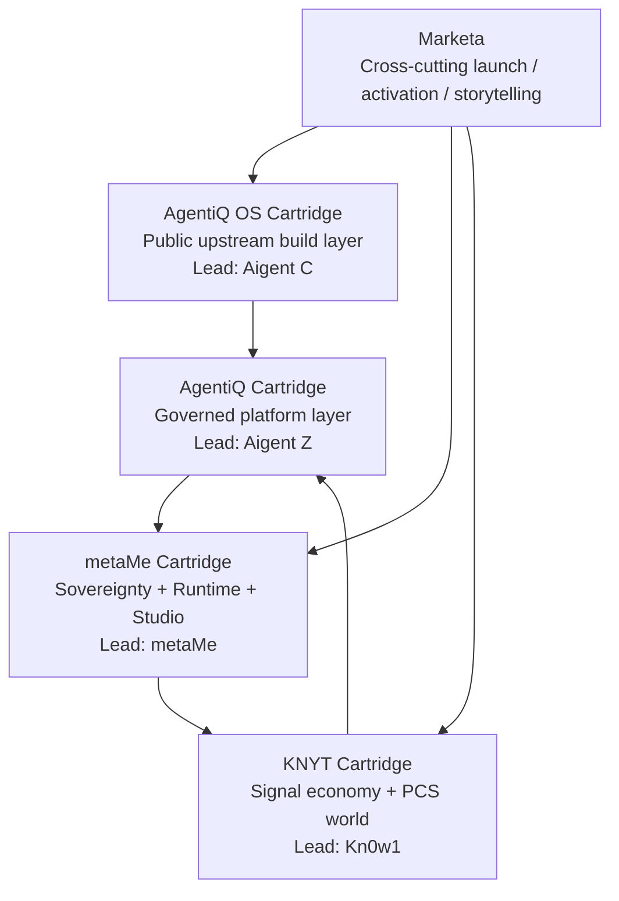

# AgentiQ Architecture Outline — Delivering Policy as the New Perimeter

**Status:** canonical  
**Authority:** product owner  
**Last updated:** 2026-04-08  
**Version:** doctrine-1.0

---

## Purpose

This document translates the AgentiQ policy-perimeter doctrine into an implementation-facing architecture outline.

It explains how the philosophy is delivered through:

- the Qripto protocol layer
- AgentiQ OS as the open operating substrate
- the AgentiQ platform control layer
- metaMe as the sovereignty and experience layer
- KNYT as the first live-world proving ground
- DVN-style verification and attested state
- lifecycle-aware storage and execution choices

This is the architecture-facing companion to `POLICY_PERIMETER_POSITION_PAPER.md`.

---

## Canonical architecture statement

AgentiQ is an **hourglass architecture**:

- open and distributed at the top where participation, contribution, and interoperability matter
- tightly governed in the waist where policy, entitlement, orchestration, and controlled execution matter
- open and distributed again at the bottom where custody, storage, receipts, anchoring, and partner systems matter

---

## Layer model

| Layer | Role | Openness model | Primary guarantee | Current code / surface |
|---|---|---|---|---|
| Qripto Protocols | Shared primitives, proofs, identity, value, iQube semantics | Open | Interoperability and portable trust semantics | protocol-adjacent doctrine, iQube / DVN framing |
| AgentiQ OS | Open operating substrate for contributors and builders | Open | Common runtime semantics and packaging standards | `packages/agentiq-sdk/`, `docs/agentiq-os/`, OS items in codex |
| AgentiQ Platform | Governed platform waist | Proprietary / governed | Policy, entitlement, orchestration, registry operations | `services/registry/`, `app/api/codex/registry/*`, `data/codex-configs.ts` |
| metaMe | Sovereignty and experience layer | Proprietary / governed | Goals, ladder, next-best-pathway, Runtime + Studio coordination | `components/composer/`, `app/components/content/SmartTriad*.tsx`, experience migrations |
| KNYT | Live-world proving ground | Proprietary world on open substrate | Signal, participation, contained economics, PCS proving ground | `app/api/codex/knyt/*`, `app/types/knyt.ts` |
| DVN-style trust layer | Verification / evidence / attested state | Open-verifiable / governed implementation | Auditability, policy evidence, durable trust trails | receipt flows, transaction trails, anchoring model |
| Storage / execution substrate | Fit-for-purpose payload + execution layer | Hybrid | Privacy, speed, survivability, permanence by objective | Supabase / tenant stores / distributed storage / controlled execution |

---

## Perimeter doctrine in the stack

AgentiQ shifts the perimeter from network location to policy-aware control.

### The old model

### The AgentiQ model

### Policy perimeter questions

| Question | Why it matters | Delivered by |
|---|---|---|
| Who is acting? | Identity and role determine authority | Persona / DID / platform identity surfaces |
| What are they touching? | Object-level control is stronger than network-level trust | Registry, codex, asset model |
| Under which entitlement? | Prevents broad implicit trust | Policy + access layer |
| In what state? | Same actor may be allowed in one state but not another | Journey / artifact / registry state |
| Into which execution realm? | Sensitive logic should not always travel | Controlled execution domains |
| With what evidence? | Trust must be attestable, not merely asserted | DVN-style receipts and state trails |

---

## How the philosophy maps to the current AgentiQ stack

### 1. Qripto protocols — open foundation

**Architectural intent**
- Shared primitives and semantics should remain inspectable and portable.
- This is where openness creates ecosystem trust.

**Delivered in practice**
- iQube and DID-oriented semantics frame how assets, policies, and identities are understood.
- DVN-style patterns define how policy evidence and state attestation should behave.

### 2. AgentiQ OS — open operating substrate

**Architectural intent**
- Builders should be able to package, submit, and compose against a stable operating model.
- The OS is open without giving away the proprietary orchestration layer.

**Delivered in practice**
- `packages/agentiq-sdk/` provides the public-facing contribution / interaction surface.
- `docs/agentiq-os/` defines contribution categories, packaging standards, and submission flow.
- The AgentiQ Codex houses OS documents as a contributor-facing operational knowledge layer.

### 3. AgentiQ Platform — governed control waist

**Architectural intent**
- This is where policy becomes the active perimeter.
- It governs intake, validation, trust interpretation, orchestration, and controlled exposure.

**Delivered in practice**
- `services/registry/*` and `types/registryIngestion.ts` implement intake → classify → validate → publish flows.
- `app/api/codex/registry/*` and `data/codex-configs.ts` surface governed codex behavior.
- Aigent Z is the control-orchestrator layer.

### 4. metaMe — sovereignty and experience governance

**Architectural intent**
- metaMe is where personal sovereignty, experience logic, progression, and next-best-pathway are managed.
- The user’s experience state is governed here, not scattered across arbitrary product surfaces.

**Delivered in practice**
- Experience model migrations and journey schemas govern goals, ladder, matrix, and progression.
- SmartTriad surfaces provide the runtime bridge between wallet, codex, and guided experience.
- Studio composes governed supply into live runtime experiences.

### 5. KNYT — live-world proving ground

**Architectural intent**
- KNYT is where participation, signal, contained tokenized economics, and early PCS stages are tested in a real world.

**Delivered in practice**
- `app/api/codex/knyt/*` implements voting, remix, and signal actions.
- `$KNYT` operates as a contained economy distinct from base-rail Q¢ logic.
- Kn0w1 acts as the in-world guide and participation layer.

---

## Cartridge topology and doctrine delivery

| Cartridge | Doctrine role | What it proves |
|---|---|---|
| AgentiQ OS | Open operating substrate | Openness can exist without surrendering platform control |
| AgentiQ | Policy waist | The real perimeter is policy, not just network location |
| metaMe | Sovereignty layer | Custody, progression, and user state can be governed coherently |
| KNYT | Live proving ground | Signal, participation, and contained economics can feed the loop |

---

## Storage doctrine in implementation form

The stack does **not** treat storage as a moral binary.

### Capability-to-mechanism table

| Objective | Primary mechanism | Typical substrate choice | Why |
|---|---|---|---|
| Privacy / confidentiality | Cryptography + controlled disclosure | Encrypted tenant or platform stores | Privacy is not guaranteed by decentralization alone |
| Auditability | DVN-style receipts + attested state | Receipts, state logs, durable anchors | Proves what happened without publishing every payload |
| Censorship resistance | Replication + distributed storage | AutoDrive / IPFS / mirrored stores | Reduces provider dependence |
| Production agility | Mutable high-performance storage | Supabase / operational DBs / active object stores | Working state needs speed and editability |
| Canonical permanence | Deliberate finalization + durable anchoring | archival / distributed / anchored state | Finality should happen at the right lifecycle stage |

### Lifecycle model

| Lifecycle stage | Dominant need | Recommended bias |
|---|---|---|
| Working | speed, editability, iteration | mutable / governed operational storage |
| Review | controlled collaboration, traceability | staged governed storage |
| Published | managed visibility, provenance | protected delivery surfaces |
| Canonical | durable trust, finality | anchored / attested / deliberate permanence |
| Archival | survivability, recovery | replicated and long-lived storage |

---

## Controlled execution doctrine

A policy-centric perimeter requires that some things remain non-shippable by default.

| Asset / capability | Default rule | Why |
|---|---|---|
| Crown-jewel orchestration | Controlled execution only | Strategic logic should not travel in plaintext |
| Internal policy graphs | Controlled execution only | Prevents leakage of governance logic |
| Sensitive prompts / routing logic | Controlled execution only | Keeps high-value operating intelligence internal |
| Trust scoring / risk interpretation | Controlled execution only | Avoids exposing competitive trust method |
| Tenant-private payloads | Tenant-custodied where appropriate | Preserves sovereignty |
| Public manifests and contribution standards | Shippable / open | These help ecosystem growth |

---

## Current codebase surfaces that express the doctrine

| Concern | Current location | Doctrine expressed |
|---|---|---|
| Public builder surface | `packages/agentiq-sdk/` | Open OS layer |
| OS standards and docs | `docs/agentiq-os/` | Open operating substrate |
| Registry governance | `services/registry/*` | Policy-governed intake and publication |
| Cartridge / codex configuration | `data/codex-configs.ts`, `types/codex.ts` | Governed experience and access surfaces |
| Studio composition | `components/composer/`, `services/composer/*` | Controlled supply-to-experience transformation |
| Runtime delivery | `app/components/content/SmartTriad*.tsx` | Sovereign runtime mediation |
| Experience model | journey / matrix migrations | State-aware progression and next-best-action |
| KNYT participation economy | `app/api/codex/knyt/*`, `app/types/knyt.ts` | Contained local-world economics |
| Aigent operating model | `.claude/agents/*`, `docs/agent-harness/*` | Authority and routing model |

---

## Delivery roadmap for doctrine hardening

### Phase 1 — doctrinal clarity
- Codify the position paper and architecture outline in the AgentiQ Codex
- Ensure OS docs, alpha architecture docs, and metame / KNYT docs align to the same language

### Phase 2 — artifact classification
- Introduce explicit shippability classes for sensitive assets
- Distinguish public-shippable, tenant-shippable, encrypted-edge, server-only, controlled-execution, never-exportable

### Phase 3 — policy-aware release governance
- Treat release pipelines as trust boundaries
- Add checks for non-shippable artifacts in public bundles
- Formalize blast-radius reduction around packaging and release

### Phase 4 — evidence-first state movement
- Expand receipt / attestation surfaces around contribution, publication, runtime delivery, and reward events
- Strengthen durable trust trails without forcing all payloads into public permanence

---

## Final implementation statement

> AgentiQ delivers policy as the new perimeter by combining an open protocol foundation, an open operating substrate, a governed platform waist, a sovereign runtime layer, a live-world proving ground, and a verifiable trust fabric. It separates custody from control, trust from payload storage, and working state from canonical state. In implementation terms, this means openness where interoperability matters, controlled execution where strategic logic matters, attested state where auditability matters, and fit-for-purpose storage where privacy, resilience, speed, or permanence each matter differently.

---

## Related documents

- `items/POLICY_PERIMETER_POSITION_PAPER.md`
- `items/ALPHA_ARCHITECTURE_MEMO.md`
- `items/ALPHA_BUILD_PLAN.md`
- `items/OS_README.md`
- `items/OS_PACKAGING_STANDARDS.md`
- `../../metame/items/METAME_EXPERIENCE_FRAMEWORK.md`
- `../../knyt/items/KNYT_EXPERIENCE_PACK_PRD.md`
