# Architecture Diagrams

All canonical Mermaid diagrams for the AgentiQ / iQube Protocol architecture.
Source: `docs/architecture/diagrams/` and `docs/architecture/AigentZ_Architecture.md`

---

## 1. C4 Context — System Overview

High-level view: users, the Aigent Z platform, and external blockchains/registries.

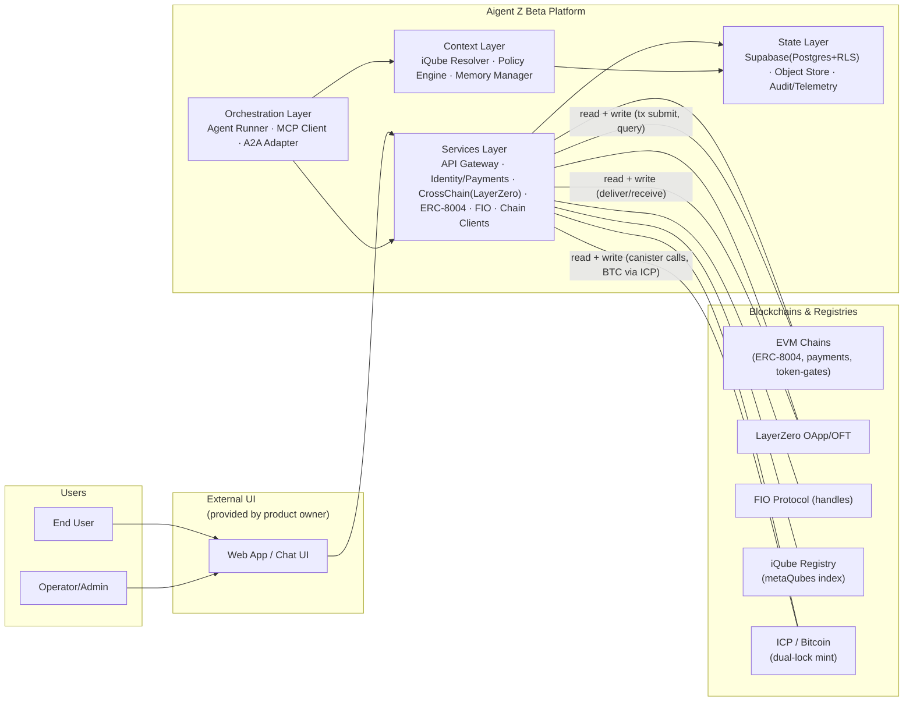

---

## 2. C4 Container — Internal Architecture

Detailed internal components across all four layers.

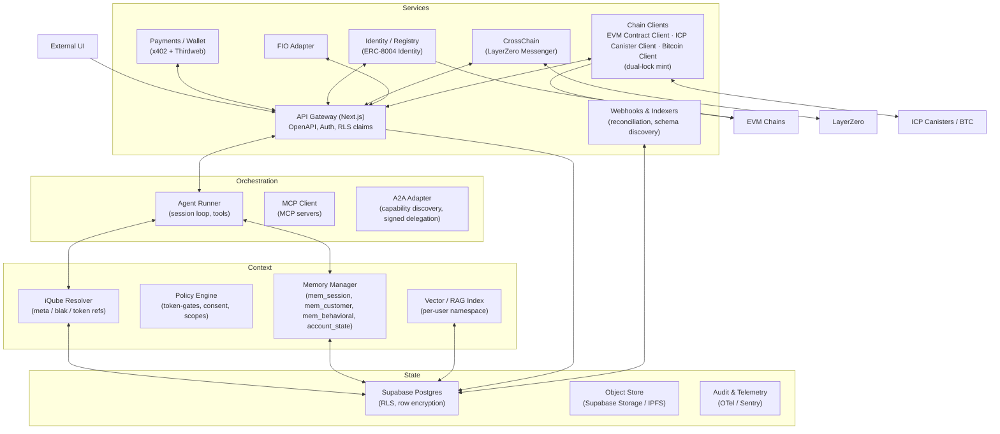

---

## 3. Data Model (ERD)

Entity-relationship diagram for the Supabase schema.

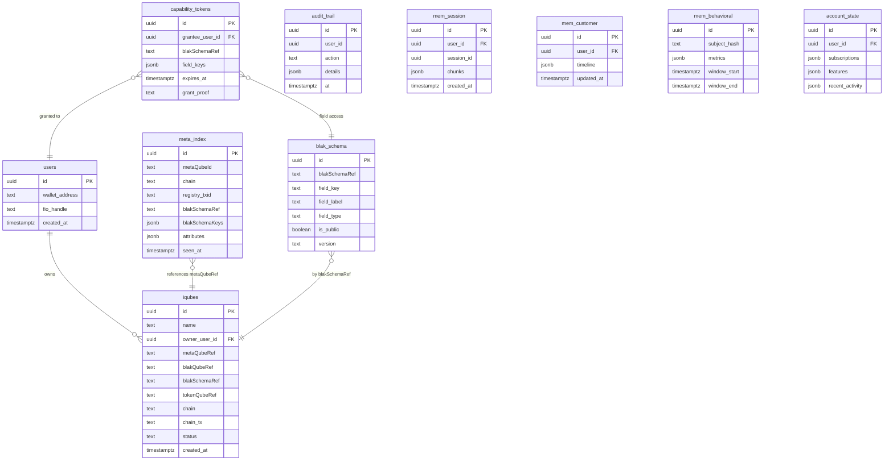

---

## 4. Token-Gated Auth & Entitlements

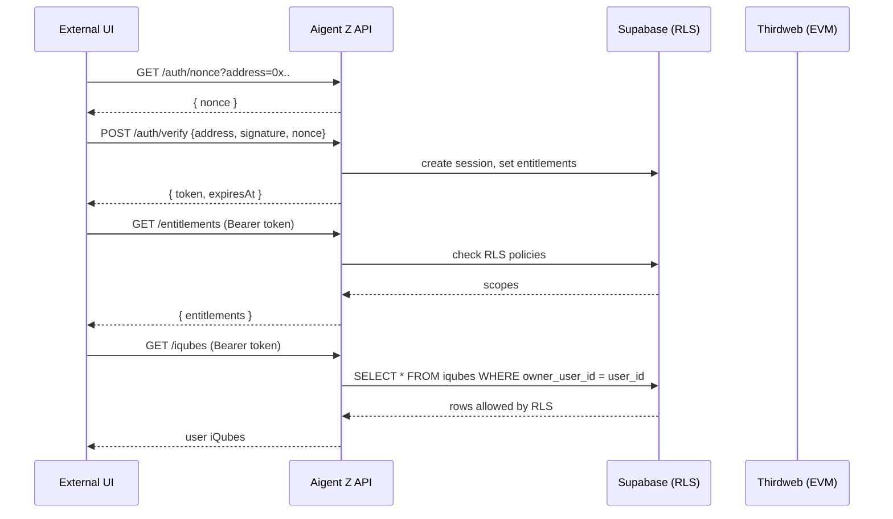

---

## 5. EVM Mint with LayerZero

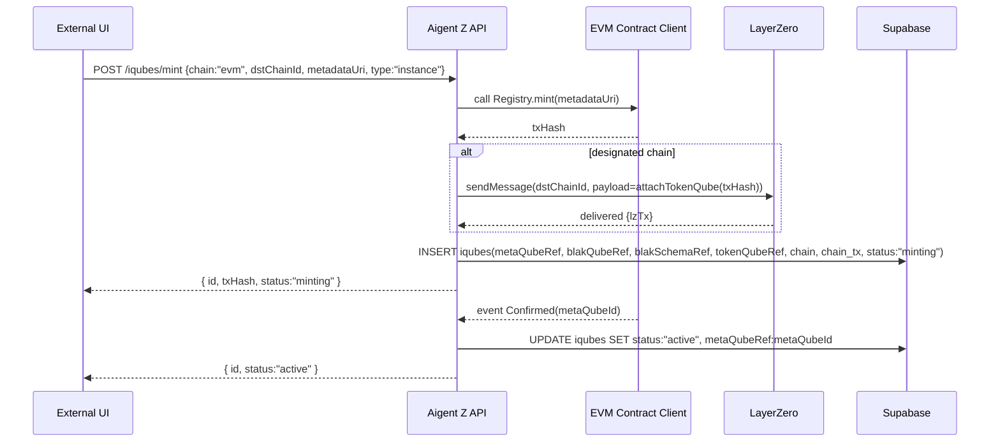

---

## 6. ICP/BTC Dual-Lock Mint

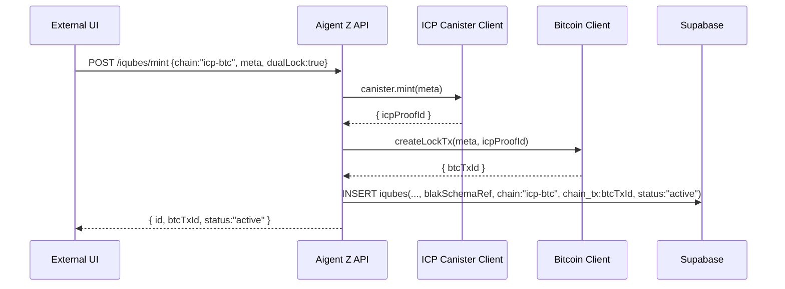

---

## 7. ICP Mint via Chain-Key Bitcoin

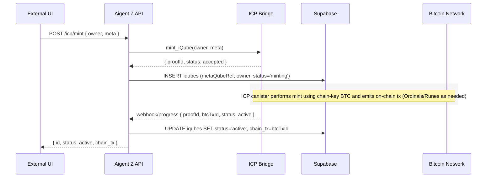

---

## 8. LayerZero EVM↔EVM Exchange

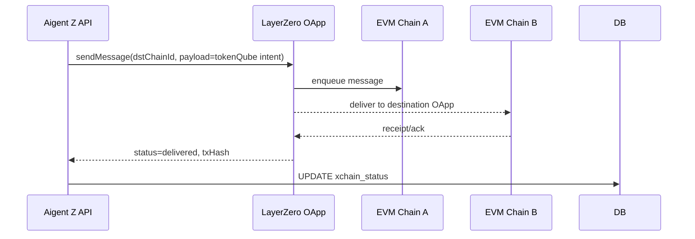

---

## 9. A2A Delegated Validation (ERC-8004)

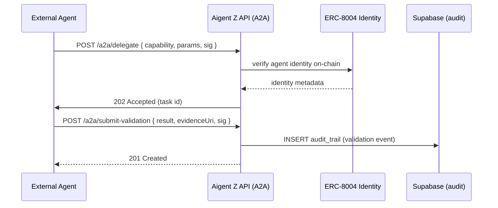

---

## 10. BlakQube Schema Discovery (Indexer)

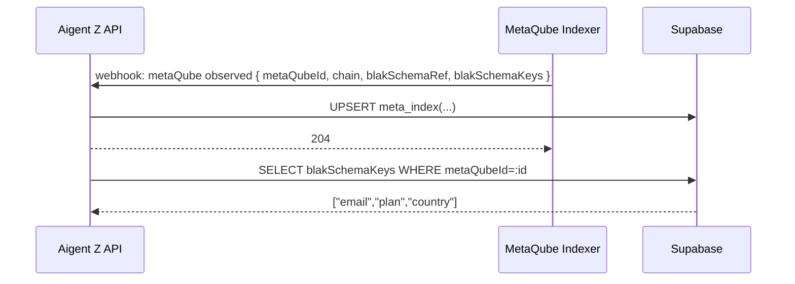

---

## 11. BlakQube Schema vs Values Read

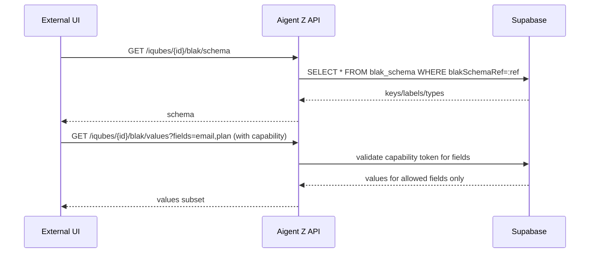

---

## 12. Capability Grant / Key Share

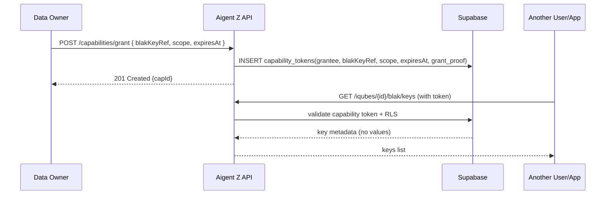

---

## Notes

- Source files: `docs/architecture/diagrams/*.mmd`
- Architecture doc: `docs/architecture/AigentZ_Architecture.md`
- All diagrams use GitHub-flavored Mermaid syntax; render natively in the codex viewer with `enableInferenceRendering`
- C4 diagrams follow the C4 model (Context → Container → Component → Code)
- Sequence diagrams show API flows at the service boundary level
