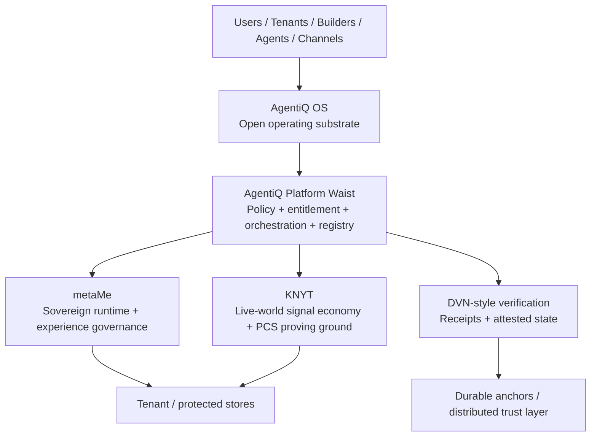
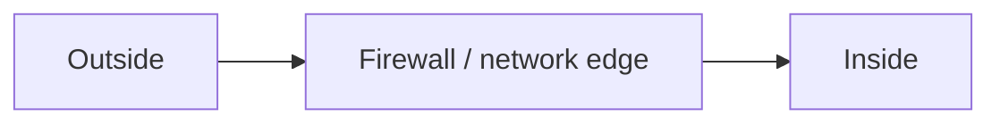
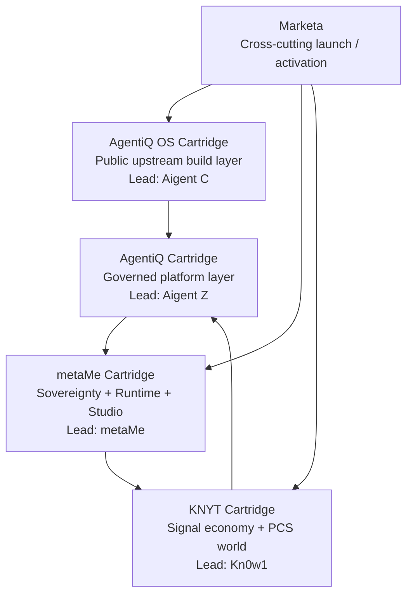

# Policy Perimeter Architecture

**Status:** canonical  
**Authority:** product owner  
**Last updated:** 2026-04-08  
**Version:** doctrine-1.0

---

## Why this document exists

This document explains how AgentiQ delivers **policy as the new perimeter** in architectural terms.

It is the implementation-facing expression of the broader doctrine that the meaningful boundary of the modern system is no longer just the firewall or network edge, but the governed intersection of:

- identity
- entitlement
- policy
- state
- controlled execution
- attested evidence

---

## Canonical architecture statement

AgentiQ is an **hourglass architecture**:

- distributed and open where participation and interoperability matter
- tightly governed where policy and orchestration matter
- distributed again where storage, custody, and verification matter

---

## Layer model

| Layer | Role | Openness model | What it guarantees |
|---|---|---|---|
| Qripto Protocols | Shared primitives, identity, value, proofs, iQube semantics | Open | Interoperability and portable trust semantics |
| AgentiQ OS | Open operating substrate for contributors and builders | Open | Stable runtime semantics and packaging model |
| AgentiQ Platform | Governed platform waist | Proprietary / governed | Policy enforcement, entitlement, orchestration |
| metaMe | Sovereignty and experience layer | Proprietary / governed | Goals, progression, Runtime / Studio coordination |
| KNYT | Live-world proving ground | Proprietary world on open substrate | Participation, signal, contained economics |
| DVN-style layer | Verification and receipts | Open-verifiable / governed implementation | Auditability, policy evidence, attested state |
| Storage / execution substrate | Fit-for-purpose payload and execution layer | Hybrid | Privacy, speed, survivability, permanence by objective |

---

## The perimeter shift

### Old model

### AgentiQ model

### What policy asks that the wall cannot

| Question | Why it matters |
|---|---|
| Who is acting? | Identity and role determine authority |
| What are they touching? | Object-level control is stronger than location-based trust |
| Under which entitlement? | Prevents broad implicit trust |
| In what state? | Access should vary by lifecycle or journey state |
| Into which execution realm? | Sensitive logic should not always travel |
| With what evidence? | Trust must be attestable, not merely assumed |

---

## Cartridge topology

| Cartridge | Architectural role | What it proves |
|---|---|---|
| AgentiQ OS | Open operating substrate | Openness and portability can exist without giving away the platform waist |
| AgentiQ | Governed waist | The real perimeter is policy, not just network location |
| metaMe | Sovereignty layer | Experience state and next-best-pathway can be governed coherently |
| KNYT | Live proving ground | Signal, participation, and contained economics can close the loop |

---

## Storage doctrine in implementation form

AgentiQ does not treat storage as a moral binary.

| Objective | Primary mechanism | Typical substrate choice |
|---|---|---|
| Privacy / confidentiality | Cryptography + controlled disclosure | Encrypted tenant or platform stores |
| Auditability | DVN-style receipts + attested state | Receipts, state logs, durable anchors |
| Censorship resistance | Replication + distributed storage | AutoDrive / IPFS / mirrored stores |
| Production agility | Mutable high-performance storage | Supabase / operational DBs / active object stores |
| Canonical permanence | Deliberate finalization + durable anchoring | archival / distributed / anchored state |

### Lifecycle model

| Lifecycle stage | Dominant need | Recommended bias |
|---|---|---|
| Working | speed, editability, iteration | mutable operational storage |
| Review | controlled collaboration, traceability | staged governed storage |
| Published | managed visibility, provenance | protected delivery surfaces |
| Canonical | durable trust, finality | anchored / attested / deliberate permanence |
| Archival | survivability, recovery | replicated long-lived storage |

---

## Controlled execution rules

A policy-centric perimeter requires that some things remain non-shippable by default.

| Asset / capability | Default rule | Why |
|---|---|---|
| Crown-jewel orchestration | Controlled execution only | Strategic logic should not travel in plaintext |
| Internal policy graphs | Controlled execution only | Prevents leakage of governance logic |
| Sensitive prompts / routing logic | Controlled execution only | Keeps high-value operating intelligence internal |
| Trust scoring / risk interpretation | Controlled execution only | Avoids exposing competitive trust method |
| Tenant-private payloads | Tenant-custodied where appropriate | Preserves sovereignty |
| Public manifests and contribution standards | Shippable / open | These should support ecosystem growth |

---

## Current stack mapping

| Concern | Current location | Doctrine expressed |
|---|---|---|
| Public builder surface | `packages/agentiq-sdk/` | Open operating substrate |
| OS standards and docs | `docs/agentiq-os/` | Open builder-facing semantics |
| Registry governance | `services/registry/*` | Policy-governed intake and publication |
| Codex / cartridge config | `data/codex-configs.ts`, `types/codex.ts` | Governed experience and access surfaces |
| Studio composition | `components/composer/`, `services/composer/*` | Controlled supply-to-experience transformation |
| Runtime delivery | `app/components/content/SmartTriad*.tsx` | Sovereign runtime mediation |
| Experience model | journey / matrix migrations | State-aware progression |
| KNYT participation economy | `app/api/codex/knyt/*`, `app/types/knyt.ts` | Contained world economics |
| Aigent operating model | `.claude/agents/*`, `docs/agent-harness/*` | Authority and routing model |

---

## Final implementation line

> AgentiQ delivers policy as the new perimeter by combining an open protocol foundation, an open operating substrate, a governed platform waist, a sovereign runtime layer, a live-world proving ground, and a verifiable trust fabric. It separates custody from control, trust from payload storage, and working state from canonical state.

---

## Related documents

- `../knowledge/policy-perimeter-position-paper.md`
- `system-map.md`
- `protocols.md`
- `data-identity.md`
- `../../agentiq/items/POLICY_PERIMETER_ARCHITECTURE_OUTLINE.md`
