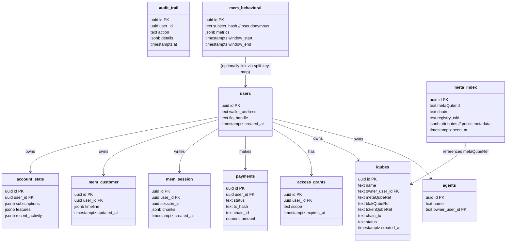
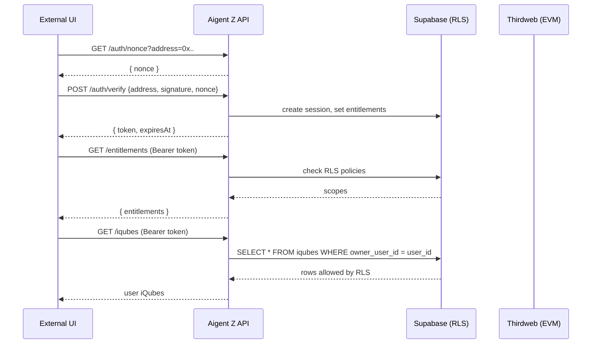
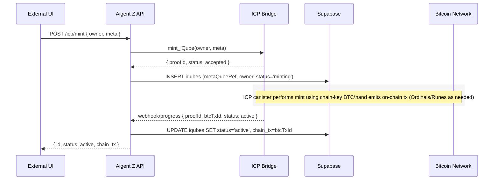
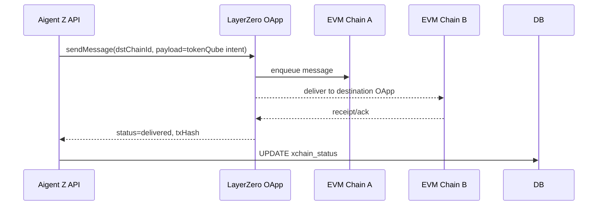
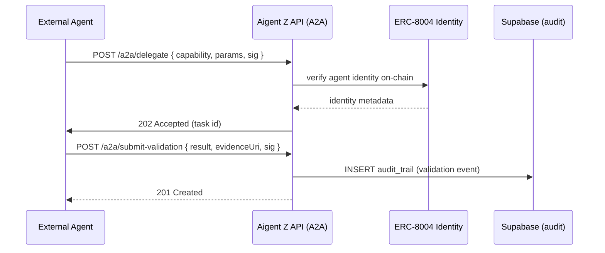

# Aigent Z Beta — Architecture (Orchestration • Context • Services • State)
_Last updated: 2025-09-08_

## 1) Overview
Aigent Z Beta follows a four-layer model:

- **Orchestration** — Agent runner (session loop), **MCP client**, and **A2A adapter** for agent-to-agent capability exchange.
- **Context** — iQube Resolver (meta/blak/token), Policy Engine (token-gates, consent), Memory Manager (session, customer, behavioral, contextual), and per-user vector/RAG.
- **Services** — API Gateway (OpenAPI), Identity/Payments (Thirdweb), CrossChain (LayerZero), Registry (ERC-8004 minimal), FIO adapter, ICP Bridge.
- **State** — Supabase Postgres (with **Row-Level Security**), object storage for blobs, and audit/telemetry.

See **C4-Context** and **C4-Container** diagrams below.

```mermaid

%% C4-Context (simplified with Mermaid)
flowchart LR
  subgraph Users
    U[End User]
    Admin[Operator/Admin]
  end

  subgraph ExternalUI[External UI (Provided by Product Owner)]
    UI[Web App / Chat UI]
  end

  U -- uses --> UI
  Admin -- operates --> UI

  subgraph AigentZ[Aigent Z Beta Platform]
    direction TB
    OG[Orchestration Layer\n- Agent Runner\n- MCP Client\n- A2A Adapter]
    CTX[Context Layer\n- iQube Resolver\n- Policy Engine\n- Memory Manager]
    SRV[Services Layer\n- API Gateway\n- Identity/Payments\n- CrossChain (LZ)\n- Registry / ERC-8004\n- FIO Adapter]
    ST[State Layer\n- Supabase (Postgres+RLS)\n- Object Store (blobs)\n- Audit/Telemetry]
  end

  UI -- REST/WebSocket (OpenAPI/SDK) --> SRV
  SRV -- "RLS-enforced SQL\n(App state)" --> ST
  OG -- "Context/Actions" --> CTX
  CTX -- "Read/Write\n(mem_*, iQube refs)" --> ST
  OG -- "Tool/Action Calls" --> SRV

  subgraph Chains[Blockchain & Registries]
    direction TB
    EVM[EVM Chains\n(ERC-8004, Payments, TokenGates)]
    LZ[LayerZero OApp/OFT]
    FIO[FIO Protocol (Handles)]
    REG[iQube Registry (metaQubes index)]
    ICP[ICP / Bitcoin (21 Sats)\n(Chain-key BTC, Ordinals/Runes)]
  end

  SRV --- EVM
  SRV --- FIO
  SRV --- LZ
  SRV --- REG
  SRV --- ICP

  classDef box fill:#0b7285,stroke:#083344,color:#fff,stroke-width:1px;
  classDef light fill:#94d2bd,stroke:#0b525b,color:#003049,stroke-width:1px;
  classDef user fill:#adb5bd,stroke:#495057,color:#212529,stroke-width:1px;
  classDef chain fill:#ffdd99,stroke:#e07a00,color:#5b3200,stroke-width:1px;

  class AigentZ box;
  class OG,CTX,SRV,ST light;
  class U,Admin user;
  class EVM,LZ,FIO,REG,ICP chain;

```

```mermaid

%% C4-Container (simplified)
flowchart TB
  subgraph Orchestration
    OR1[Agent Runner\n(session loop, tools)]
    OR2[MCP Client\n(MCP servers)]
    OR3[A2A Adapter\n(capability discovery, signed delegation)]
  end

  subgraph Context
    CX1[iQube Resolver\n(meta/blak/token refs)]
    CX2[Policy Engine\n(token-gates, consent, scopes)]
    CX3[Memory Manager\n(mem_session, mem_customer,\nmem_behavioral, account_state)]
    CX4[Vector/RAG Index\n(per-user namespace)]
  end

  subgraph Services
    S1[API Gateway (FastAPI/Flask)\nOpenAPI, Auth, RLS claims]
    S2[Payments/Wallet\n(Thirdweb)]
    S3[Identity/Registry\n(ERC-8004 Identity)]
    S4[CrossChain\n(LayerZero OApp)]
    S5[FIO Adapter]
    S6[ICP Bridge\n(IcpMint/Attest/Proof)]
    S7[Webhooks & Jobs\n(reconciliation, retries)]
  end

  subgraph State
    DB[(Supabase Postgres\nRLS, Row Encryption)]
    OBJ[(Object Store\n(e.g., Supabase Storage))]
    LOG[(Audit & Telemetry\n(OTel/Sentry))]
  end

  UI[External UI] --> S1
  S1 <--> OR1
  OR1 <--> CX1
  OR1 <--> CX3
  CX1 <--> DB
  CX3 <--> DB
  CX4 <--> DB
  S1 --> DB
  S2 <--> S1
  S3 <--> S1
  S4 <--> S1
  S5 <--> S1
  S6 <--> S1
  S7 <--> DB
  S2 --> EVM[EVM Chains]
  S3 --> EVM
  S4 <--> LZ[LayerZero]
  S5 <--> FIO[FIO]
  S6 <--> ICP[ICP/BTC module]

```

---

## 2) State & Data Model (Supabase)
Supabase is the **system-of-record for application state**, not for private payloads. iQube payloads live off-platform; the app stores **pointers and proofs**, and enforces access by **token-gated policies** and **user consent**.



### 2.1 Tables (high level)
- `users` — Wallet address, FIO handle.  
- `agents` — Registered agents owned by users.  
- `iqubes` — iQube rows with `metaQubeRef`, `blakQubeRef`, `tokenQubeRef`, on-chain tx/proofs, and status.  
- `access_grants` — Token/role-scoped grants, with expiry.  
- `payments` — Payment intent/receipt records; webhooks materialize access grants.  
- `audit_trail` — Signed events (no PII).  
- **Memory**: `mem_session`, `mem_customer`, `mem_behavioral`, `account_state`.  
- `meta_index` — Global index of **all metaQubes** observed on-chain and via the Registry; **full app visibility** by design.

### 2.2 Row-Level Security (RLS) Policy Matrix
| Table | Data Subject | User View | Admin View | Notes |
|---|---|---|---|---|
| `mem_session` | user | **Allowed** (only own) | **Denied** | Per-row encryption (client/KMS-wrapped); short TTL |
| `mem_customer` | user | **Allowed** (only own) | **Denied** | Export/forget tools; long-lived history |
| `mem_behavioral` | pseudonymous | **Allowed** (own identifiable view) | **Allowed** **pseudonymously** | Split-key mapping prevents admin re-id |
| `account_state` | user | **Allowed** (own) | **Allowed** (identifiable) | Operational need; all reads audit-logged |
| `iqubes` | user | **Allowed** (own iQubes) | **Allowed** (ops) | BlakQube refs are opaque; deref via policy |
| `meta_index` | public | **Allowed** | **Allowed** | App-wide visibility to all minted metaQubes |
| `payments` | user | **Allowed** (own) | **Allowed** (ops) | Amounts and tx hashes only |
| `audit_trail` | N/A | **N/A** | **Allowed** | No PII stored |

### 2.3 Encryption
- **User-private** memories use per-row envelope encryption (client-side recommended) or server KMS; keys **not** available to admins.  
- Token-gates and consent scopes are enforced **before** dereferencing any blakQube ref.

---

## 3) Memory Architecture (Session • Customer • Behavioral • Contextual)

**Goals:** user privacy by default, user-searchable memory, admin access limited to what’s operationally necessary, strong audit.

1. **Session Memory** (`mem_session`)  
   - **Owner:** user. **Admin access:** none.  
   - **Scope:** current conversation; compact chunking with per-user vector index.  
   - **Controls:** TTL (e.g., 30 days), export/forget, RLS + field encryption.  
2. **Customer Memory** (`mem_customer`)  
   - **Owner:** user. **Admin access:** none.  
   - **Scope:** cross-session timelines, preferences, saved assets.  
   - **Controls:** explicit user consent prompts for new categories; export/forget.  
3. **Behavioral Memory** (`mem_behavioral`)  
   - **Owner:** platform; **User view:** identifiable metrics; **Admin view:** **pseudonymous aggregates**.  
   - **Controls:** subject hashing + split-key mapping; differential privacy for analytics.  
4. **Contextual Memory** (`account_state`)  
   - **Owner:** platform; **User view:** full; **Admin view:** identifiable (ops).  
   - **Controls:** read audit logs; RBAC; retention policy.

**Indexing/Search:** full‑text + vector search with **per-user namespaces**; queries execute under the user’s RLS context so other rows are never visible.

**Auditability:** every admin read to `account_state`, `iqubes`, and cross‑chain status tables is audit‑logged with purpose strings.

---

## 4) Orchestration & Context Flows (Sequences)

### 4.1 Token-Gated Login & Entitlements


### 4.2 Mint BTC-Native iQube via ICP (21 Sats)


### 4.3 Cross-Chain TokenQube Exchange (LayerZero; EVM↔EVM today)


### 4.4 A2A Delegated Validation with ERC-8004 Identity


---

## 5) Multichain Architecture & Modularity

**Abstraction seams** keep the platform swappable without breaking API/DB contracts:

- `PaymentGateway` → EVM via Thirdweb today; could swap to other providers.  
- `IdentityRegistry` → ERC‑8004 Identity minimal (on EVM).  
- `CrossChainService` → LayerZero OApp/OFT for tokenQube exchange (EVM); future adapters can extend.  
- `IqubeBridge` → ICP/Bitcoin client (mint/attest/prove) behind a stable interface.

**Global metaQube visibility** comes from a **MetaQube Indexer** service that watches the iQube Registry and chain events and persists into `meta_index`—this allows app-wide searches, analytics, and gating policies that depend on public metadata.

---

## 6) Deployment, Security & Ops

- **Environments:** local/dev/staging/prod; pinned versions; GitHub Actions for lint/test/build; SBOM + SCA scans.  
- **AuthN/Z:** wallet login + entitlements; FIO handle linking; token-gates on endpoints; schema validation on all inputs.  
- **Network:** strict CORS, HSTS, CSP; signed webhooks; API keys for MCP/A2A endpoints; rate limits.  
- **Observability:** structured logs (no PII), request IDs, OTel traces; alerts for cross-chain lag and mint failures.  
- **Backups/DR:** PITR for Postgres; key escrow for encrypted fields; disaster drills documented.  
- **Runbooks:** deploy/rollback, incident playbooks, on-call rotation.

---

## 7) Future: Transition to 21 Sats ICP/Bitcoin

- Implement `IcpMintClient`, `IcpAttestClient`, and `ProofStore` modules; wire to `/icp/*` endpoints and `iqubes` rows.  
- Chain‑key Bitcoin and Ordinals/Runes indexing remain external; app persists **proof IDs/txids** and verification hashes only.  
- Feature flags/config toggles so staging can switch **mock ↔ real canisters** without code changes.  
- Keep **API and database contracts stable**, enabling UI to remain unchanged as the infrastructure swaps under the hood.

---

## 8) References & Prior Art

- **Nakamoto (Supabase + MCP client precedent):** the repo lists a `supabase/` folder and a `SETUP_MCP_CLIENT.md` config guide, which align with this design.  
- **iQube Registry:** public/meta registry leveraged for `meta_index`.  
- **Aigent Z Beta:** primary app target for all integrations and services.

> Note: I could not access the Recall article from this environment; I incorporated widely adopted privacy-first memory patterns (user-searchable, explicit retention, audit logs, admin pseudonymization) and aligned them with your requirements. If you want me to reflect specific passages, share the text and I’ll fold them in verbatim.

---

## Appendix A — API Surfaces (excerpt)
- Auth: `/auth/nonce`, `/auth/verify`  
- Entitlements: `/entitlements`  
- iQubes: `/iqubes`, `/iqubes/{id}`, `/iqubes/{id}/status`  
- Payments: `/payments/intent`, `/payments/{id}`, `POST /webhooks/payments`  
- MCP: `/mcp/context-bundle`, `/mcp/trigger-action`  
- ERC‑8004: `/erc8004/identity`, `/erc8004/identity/{address}`  
- FIO: `/fio/link`, `/fio/profile`  
- Cross‑chain: `/xchain/message`, `/xchain/{msgId}/status`  
- A2A: `/a2a/delegate`, `/a2a/submit-validation`  
- ICP: `/icp/mint`, `/icp/attest`, `/icp/proofs/{id}`
