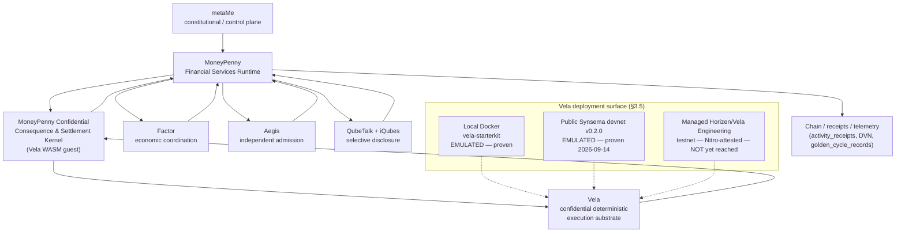
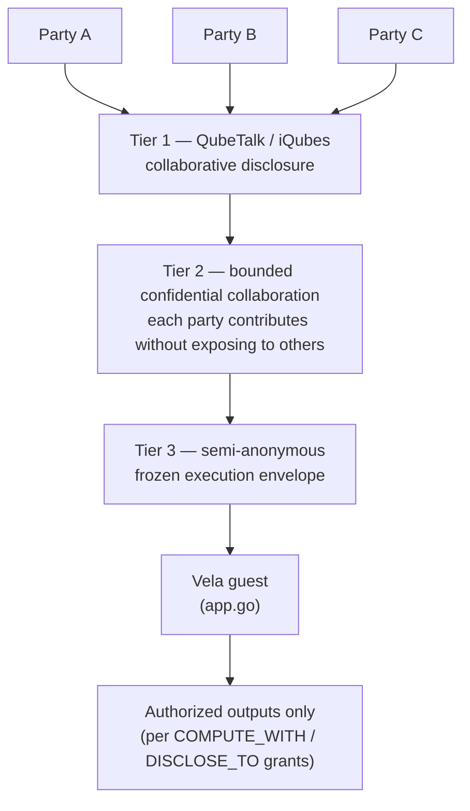
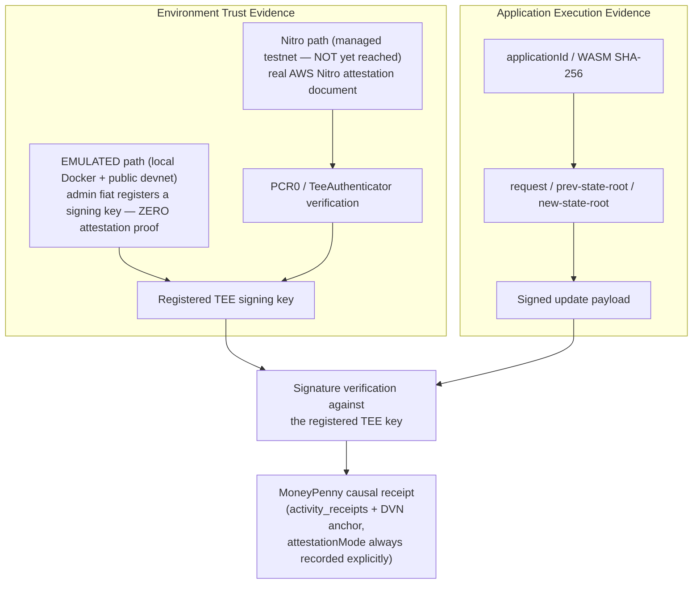
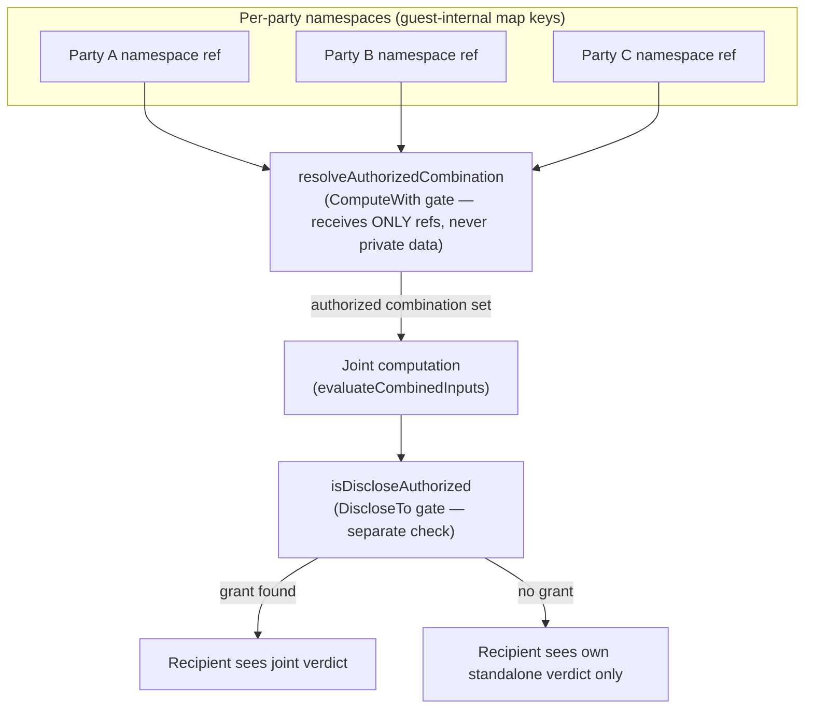

# Vela Implementation Architecture — MoneyPenny Constitutional Consequence & Settlement Kernel

**Version:** 1.1
**Date:** 14 September 2026 (revision 1.1, same day as 1.0 — adds the public Vela v0.2.0 devnet
remote-execution milestone; filename retained per this package's own filename policy)
**Audience:** Horizen / Vela technical team
**Status:** Implementation architecture note — describes the architecture **as implemented today**,
not the full future Constitutional Risk / insurance roadmap. Where a capability is planned but not
yet built, this document says so explicitly rather than implying it exists.

**What changed in 1.1:** the current MoneyPenny guest has now been deployed to and executed on a
REMOTELY OPERATED Vela v0.2.0 instance (the public Synsema devnet, `https://devnet.synsema.app/`) —
not just the local Docker Compose stack §3.1 already described. This is a **remote interoperability
milestone**: it proves the guest works through the standard Vela deploy/register/submit/poll/decode
lifecycle against infrastructure this codebase does not control, using a real Authority Service
upload and real on-chain `ASSOCIATEKEY`/`submitDeployRequest`/`submitRequest` calls. It is
**explicitly not** the managed Horizen/Vela Engineering Nitro-attested testnet milestone — the public
devnet runs an **EMULATED TEE** (`attestationMode: 'no_attestation'`), identical in trust class to
the local stack, never Nitro-attested. See §3.4 and the Implementation Status table (§3.5).

**Scope discipline:** every claim below is grounded in current repository code, tests, migrations,
or a Vela-team-confirmed statement from the accelerator package
(`docs/vela/accelerator/constitutional-financial-services/`). Where a claim is inferred rather than
directly verified in code, it is marked **[inferred]**. Nothing here should be read as a claim about
production/mainnet deployment, per-request Nitro attestation, application upgrade/migration, or
insurance capacity that does not exist.

---

## 1. System context

### 1.1 The roles

| Role | Responsibility |
|---|---|
| **metaMe** | Constitutional/control plane — personhood continuity, identity/persona, Passport, authority, delegation, mandate, Standing, receipts. |
| **MoneyPenny** | Financial Services Runtime — multi-party coordination, disclosure policy, risk-slice composition, consequence-envelope construction, confidential-execution admission, settlement coordination, causal receipt binding. |
| **Factor** | Economic coordination — discovers and proposes candidate agents/services/counterparties; assembles candidate transaction graphs; **never** confers admission, standing, or execution authority. |
| **Aegis** | Independent trust/admission membrane — assesses candidate provenance, evidence quality and reliability; produces admission evidence; **never** authorizes execution itself. |
| **QubeTalk + iQubes** | Selective disclosure / sovereign information-sharing plane — Tier-1 collaborative disclosure and provenance-bound consent. |
| **MoneyPenny Constitutional Consequence & Settlement Kernel** | The first Vela application — a narrow, deterministic, stateless-per-call WASM guest. |
| **Vela** | Verified confidential deterministic execution substrate (Horizen). Proves an accepted state transition came from a registered confidential execution environment. Does not decide constitutional authority and does not prove application logic is correct. |

### 1.2 The governing distinction

> **Vela proves that an accepted state transition came from the registered confidential execution
> environment. Constitutional Computing proves why that transition was allowed to matter.**
> — `04_VELA_MASTERCLASS_ARCHITECTURE_DELTA_v0.2.md`

### 1.3 The pilot use case

Multi-party portfolio/financial-service coordination with horizontal (per-party) and vertical
(process/risk) apportionment, culminating in a confidential consequence/risk computation inside Vela
and an optional underwriting quote. Short form (`05_ACCELERATOR_USE_CASE_ZERO_SPEC_v0.1.md`):

> **Measure → price → cover/assume → execute → observe → settle → recalibrate.**

The currently-shipped slice covers a bounded subset of this: measure (Vela confidential projection),
price (a deterministic simulated underwriting quote), and the causal-receipt/telemetry loop.
Execute/settle exist as an explicit, optional, asset-bearing path that is never triggered by a quote
alone (§7). Observe/recalibrate exist as `golden_cycle_records` evidence rows explicitly marked
`operational_hypothesis_generating` (§9) — not yet a scientifically-registered feedback loop.

---

## Diagram 1 — System architecture



---

## 2. End-to-end implementation flow

```
Factor selection → Aegis admission → QubeTalk/iQube disclosure authorization
  → MoneyPenny composition gate → frozen multi-party consequence/risk envelope
  → Vela confidential execution → underwriting quote → optional settlement
  → causal receipt / DVN anchoring → Constitutional Risk / Golden Cycle telemetry
```

| Step | Implemented? | Source |
|---|---|---|
| Factor selection | **Yes** | `services/factor/factorSelectionArtifact.ts` (`proposeFactorSelection`/`recordFactorSelection`) |
| Aegis admission | **Yes** | `services/vela/velaUnderwritingAdmissionEvidence.ts` (`composeUnderwritingAdmissionEvidence`, reads `services/aegis/aegisAssessmentService.ts`, read-only) |
| Disclosure authorization | **Yes** | `services/vela/velaUnderwritingDisclosureAuthorization.ts` (`authorizeUnderwritingDisclosure`) — binds the real Vela wire-format `VelaMultiPartyDisclosureScope`, not a second shape |
| Composition gate | **Yes** | `services/vela/velaUnderwritingCompositionGate.ts` (`composeUnderwritingEnvelope`) — cross-references selection/admission/disclosure, resolves `FROZEN` or `BLOCKED` |
| Frozen envelope | **Yes** | `FrozenUnderwritingEnvelope` — `envelopeRef`, `selectionRef`, `admissionRef`, `disclosureAuthorizationRef`, `requestRef`, `applicationId`, `candidateAgentId`, `scope`, `frozenAt` |
| Vela confidential execution | **Yes** (against the proven local stack; not yet against a managed testnet — see §11) | `services/vela/velaMultiPartyProjection.ts` + `services/vela/wasm/projector/app/app.go` |
| Underwriting quote | **Yes**, `SIMULATED` only | `services/financialServices/providers/underwriting/simulatedUnderwritingProvider.ts` |
| Optional settlement | **Structural path exists; never auto-triggered** | `VelaAssetRef` passed explicitly and only by the caller, before any quote is computed (§7) |
| Causal receipt | **Yes** | `createActivityReceipt` — `vela_underwriting_envelope_frozen`, `vela_underwriting_projection_completed`, plus admission/disclosure receipts |
| DVN anchoring | **Yes** | `services/dvn/activityReceiptDvnPipeline.ts`'s `ANCHORABLE_ACTION_TYPES` includes all four `vela_underwriting_*` action types |
| Golden Cycle telemetry | **Yes**, explicitly hypothesis-generating | `services/vela/velaUnderwritingRiskTelemetry.ts` → `golden_cycle_records`, `evidence_status: 'operational_hypothesis_generating'` |

---

## Diagram 2 — End-to-end causal flow

```mermaid
flowchart LR
    Select["Select<br/>Factor selection"] --> Admit["Admit<br/>Aegis admission"]
    Admit --> Authorize["Authorize<br/>disclosure authorization"]
    Authorize --> Freeze["Freeze<br/>frozen envelope"]
    Freeze --> Execute["Execute<br/>Vela projection"]
    Execute --> Quote["Quote<br/>underwriting quote"]
    Quote --> Settle["Settle<br/>optional, explicit only"]
    Settle --> Receipt["Receipt<br/>causal receipt + DVN"]
    Receipt --> Telemetry["Telemetry<br/>golden_cycle_records"]
```



Each step's state is one of `not_started | in_progress | blocked | unresolved | complete`
(`services/vela/velaUnderwritingChainProjection.ts`) — `'complete'` never implies a favorable
outcome; a BLOCKED envelope still produces `complete` records for Select/Admit/Authorize.

The `Execute` step itself has now been proven against two independent Vela deployments (local Docker
and the public devnet, §3.4) — this causal shape does not change based on which deployment ran it;
only the deployment-specific evidence (§9.4) differs.

---

## 3. Vela-specific trust and execution model

### 3.1 Two independent evidence layers

Per the Vela-team-confirmed baseline (`11_VELA_TEAM_CONFIRMED_BASELINE_v0.1.md` §2), attestation is
**not** a per-request proof:

1. Nitro produces a standard AWS Nitro attestation document certifying the TEE signing public key
   and enclave measurements.
2. Vela Engineering performs the environment setup transaction.
3. Vela's on-chain `TeeAuthenticator` verifies the attestation (NitroProver path) and checks PCR0
   against the approved environment/version measurement.
4. The TEE signing key is registered on-chain.
5. Each subsequent update payload is accepted by verifying it was signed by that registered key.

This repo's own implementation distinguishes exactly this pair of evidence classes:

- **Environment Trust Evidence** — which Vela instance/network, its `TeeAuthenticatorAddress`,
  `ProcessorEndpointAddress`, and attestation mode.
- **Application Execution Evidence** — `applicationId`, request ID, previous/new state root, signed
  update reference, outcome.

**What is actually implemented today**, precisely — not the richer four-state vocabulary
(`EMULATED | ATTESTED | UNRESOLVED | REVOKED`) the accelerator docs propose, but a real, simpler,
already-shipped two-value type:

```ts
// services/vela/velaTypes.ts
export type VelaAttestationMode = 'no_attestation' | 'nitro_attested';
// maps 1:1 to the domain layer (types/confidentialProjection.ts):
// 'no_attestation' -> 'NO_ATTESTATION_LOCAL', 'nitro_attested' -> 'NITRO_ATTESTED'
```

`resolveVelaDeployment('early_access')` (`services/vela/velaConfig.ts`) reads every Vela deployment
coordinate (chain ID, RPC URL, `ProcessorEndpoint`, `TeeAuthenticator`, subgraph URL, attestation
mode) from a required env var and **throws** a named "missing X" error rather than defaulting to a
guessed value or silently downgrading attestation mode. The proven, currently-exercised deployment
(`VELA_LOCAL_DEPLOYMENT`) runs the local `vela-starterkit` Docker Compose stack's
`NoAttestationTeeAuthenticator` — `attestationMode: 'no_attestation'` — **not** a real
Nitro-attested `TeeAuthenticator`. No managed Base Sepolia/Horizen deployment exists yet in this
repo's configuration (see §11).

`applicationId` deliberately has **no** env var and is **not** part of the static deployment
descriptor — it is a property of one deployment transaction against a specific chain's current
state, supplied per-call, never baked into config.

### 3.2 Application identity is a version boundary

Team-confirmed: no in-place WASM upgrade exists yet. A new WASM means a new `applicationId`, fresh
state, and manual unlocking of any old locked funds. This repo's evidence model reflects that:
`FrozenUnderwritingEnvelope.applicationId` is sourced from the disclosure authorization (the one
artifact in the chain that actually carries an `applicationId` — see §6) and bound into every
downstream receipt.

### 3.3 The architectural invariant this codebase is built against

> **Vela proves that an accepted state transition came from the registered confidential execution
> environment. Constitutional Computing proves why that transition was allowed to matter.**

Nothing in this implementation treats a successful Vela request as a semantic proof of anything
beyond "the registered environment executed this deterministic logic and returned a signed result."

**Qualified for the public devnet (§3.4):** on an EMULATED-TEE deployment, a successful Vela request
proves only **Application Execution Evidence** — that the standard Vela v0.2.0 deploy/register/
submit/poll/decode lifecycle ran our exact guest and produced a signed state transition. It proves
nothing about **Environment Trust Evidence** beyond "no attestation was claimed or checked" — the
same trust class as the local Docker stack. Only a genuinely Nitro-attested deployment (not yet
reached — §11) would add real Environment Trust Evidence on top of this.

### 3.4 Public Vela v0.2.0 devnet — remote interoperability proof (new, 14 September 2026)

A public, Synsema-operated instance of the Vela v0.2.0 starter kit
(`https://devnet.synsema.app/`) — Anvil, the Vela contracts, the subgraph, the Manager, and an
Executor with an **emulated** enclave — is reachable over the open internet and grants ephemeral
per-caller accounts via `POST /token` (10,000 test ETH, `DEPLOYER_ROLE`, 100,000 test TST). This is
explicitly **not** Horizen/Vela Engineering's managed environment: it is a third-party convenience
instance for iteration, reset periodically, never durable.

**What was proven, against this real remote instance, using the CURRENT unmodified guest**
(`services/vela/wasm/projector/app/app.go`, commit `de4222fe7`, SHA-256
`085869849896aa423a5fa6c13cc5651a4446240b538e37c6a517dbd3cbdecf02`):

1. **Real Authority Service upload + `submitDeployRequest`.** The WASM artifact was uploaded via
   `POST {AuthorityServiceURL}/deploy/upload` (multipart, contract read directly from
   `HorizenOfficial/vela-nova`'s pinned `wallet/cmd/deployapp.go` — not guessed), returning
   `{artifactId: "sha256:<hex>", wasmSha256: "<hex>"}` that matched the locally-computed hash
   byte-for-byte. `submitDeployRequest` was then called on-chain with a `DeployDescriptor` referencing
   that artifact, returning a real `applicationId` after polling `DeployRequestCompleted`.
2. **Real `ASSOCIATEKEY` registration.** Three independent transport/test identities (Party A — the
   devnet-granted account; Party B, Party C — freshly generated local EVM keypairs, funded from
   Party A) each registered a P-521 communication key via a real on-chain `ASSOCIATEKEY`
   (RequestType=3) call before any confidential request was attempted.
3. **Multi-party namespace/`COMPUTE_WITH`/`DISCLOSE_TO`/non-transitivity/fail-closed `UNRESOLVED`,
   exercised remotely, not merely unit-tested locally:**
   - **Case A (invalid scope binding):** both parties' decoded disposition = `UNRESOLVED`, confirmed
     via the raw on-chain result (`errorCode: 0`, genuinely guest-computed — not an execution
     failure; see §9.4).
   - **Case B (authorized joint computation, restricted disclosure):** Party A received the real
     joint verdict (`UNACCEPTABLE`); Party B — combined but never granted `DISCLOSE_TO` — received
     its own, decisively DIFFERENT standalone verdict (`ACCEPTABLE`). The two values were chosen to
     differ so this is a decisive proof of restricted disclosure, not a coincidence of matching
     verdicts.
   - **Case C (scope replay / non-transitivity):** a previously-valid scope, replayed against a
     genuinely new request, resolved `UNRESOLVED`/`UNRESOLVED` for both parties.
4. **A real execution-fee finding, corrected before being reported as proof** (§9.4): the first
   attempt at Cases A–C used the bare `minFeePerRequest()` and every case failed with
   `errorCode 12 "insufficient fuel: required 25 wei, provided 10 wei"` — a fee shortfall that
   decodes identically to a genuine `UNRESOLVED` unless the raw `errorCode` is inspected. Corrected by
   raising the fee ceiling; re-run confirmed `errorCode: 0` on every case before any result was
   trusted.

**What this does NOT mean:** Nitro hardware attestation (the devnet is `NoAttestationTeeAuthenticator`
throughout); production/managed-testnet persistence (every `applicationId` obtained is ephemeral —
the instance resets periodically); live underwriting or live settlement; durable state.

Reproducible via `scripts/vela/public-devnet-smoke.ts` (credentials read from a file outside the
repo, never hardcoded/committed). Full evidence, redacted request/tx/application IDs, and the case-by-
case reasoning: `codexes/packs/agentiq/updates/2026-09-14_vela-public-devnet-v0.2.0-milestone.md`.

### 3.5 Implementation status

| Deployment | WASM deploy | Real request path | Multi-party semantics | Hardware attestation | Persistence | Status |
|---|---|---|---|---|---|---|
| **Local Docker Vela v0.2.0** | Proven | Proven | Proven (unit + live local) | None (`NoAttestationTeeAuthenticator`) | None — resets on container restart | **LIVE-PROVEN** (this codebase's primary dev/proof environment) |
| **Public Vela v0.2.0 Devnet** | Proven (real Authority Service + `submitDeployRequest`) | Proven (real `ASSOCIATEKEY` + `submitRequest` + poll + decode) | Proven remotely, Cases A/B/C (§3.4) | None (emulated, third-party-operated) | None — instance resets periodically | **REMOTE INTEROPERABILITY PROVEN** (14 Sept 2026) — never a substitute for the row below |
| **Managed Horizen/Vela Engineering testnet** | Not yet submitted (bundle prepared — see the managed-deployment handoff doc) | Not yet attempted | Not yet attempted | Real Nitro attestation (not yet obtained) | Managed by Vela Engineering (durability model unconfirmed) | **NOT YET REACHED** — the one real remaining milestone for production-class trust |

---

## Diagram 3 — Three-tier disclosure model



---

## 4. Multi-party confidentiality architecture

### 4.1 The three tiers

| Tier | What happens | Where |
|---|---|---|
| **Tier 1 — Collaborative disclosure** | Parties intentionally share information via QubeTalk/iQubes under purpose, provenance and consent. | `03_MONEYPENNY_DISCLOSURE_AND_RISK_ARCHITECTURE_v0.1.md` §3 |
| **Tier 2 — Bounded confidential collaboration** | Each party contributes protected information without necessarily disclosing it to counterparties; MoneyPenny composes only authorized fields. | Same doc §3 |
| **Tier 3 — Minimum-necessary confidential execution** | MoneyPenny transforms the permitted contributions into a frozen, semi-anonymous execution envelope; Vela receives only what is required. | `services/vela/velaUnderwritingCompositionGate.ts` |

**"Semi-anonymous"** (canonical metaMe term): strong transaction-scoped pseudonymization, **not** a
claim of unlinkable anonymity. Content confidentiality is not metadata invisibility; pseudonymization
is not absolute anonymity; re-identification paths must themselves be governed.

### 4.2 Guest-side enforcement — implemented, not merely designed

The properties below are enforced **inside the compiled WASM guest**
(`services/vela/wasm/projector/app/app.go`), not only by a TypeScript-side wrapper — a TS-side gate
alone cannot retroactively fix an unauthorized combination that already happened inside the enclave.

- **Per-party namespace refs.** Each party's private inputs are keyed by a deterministic,
  opaque `namespace ref` (`services/vela/velaPartyNamespace.ts`'s `deriveVelaPartyNamespaceRef` —
  `sha256(applicationId:authorityPrincipal:confidentialPrivacyIdentity)`, first 16 hex chars,
  reusing this repo's existing `constitutionalRef` commitment helper). The guest treats the ref as
  opaque and never recomputes it.
- **Explicit `COMPUTE_WITH`.** A party's private inputs may be combined with others' **only** when an
  explicit `ScopeGrant{Action: "COMPUTE_WITH", Party: <ref>}` names them for this exact request. The
  authorization gate (`resolveAuthorizedCombination`) receives only namespace refs and plain
  strings — its own function signature makes it structurally incapable of reading, combining, or
  leaking private data.
- **Explicit `DISCLOSE_TO`.** Consenting to have data combined (`COMPUTE_WITH`) grants nothing about
  what any party may **see** as a result. A recipient's own event carries the joint verdict only
  when they were validly combined **and** every other combined party granted them
  `DISCLOSE_TO` explicitly (`chooseVerdictForRecipient`) — otherwise they receive only their own
  standalone verdict.
- **Use ≠ reveal.** The two `ScopeAction` checks (`resolveAuthorizedCombination` for `COMPUTE_WITH`,
  `isDiscloseAuthorized` for `DISCLOSE_TO`) are wholly separate functions, neither derived from the
  other.
- **Scope binding to application/request/operation/output context.** `ScopeBinding{ApplicationID,
  RequestRef, OperationType, OutputClass}` is checked against the current request's own context
  **before** any grant is consulted — a scope valid for one context is rejected outright against any
  other, even with identical parties.
- **Non-transitivity.** A scope minted for one `RequestRef` never authorizes a different request,
  even with the same parties and grants.
- **Fail-closed `UNRESOLVED`.** Malformed JSON in the scope, a missing scope, a mismatched binding,
  or an unrecognized operation/output class **all** resolve to `UNRESOLVED` for every party, checked
  before any cross-party data access — never a partial/best-effort decision.
- **Sender address is never namespace authority.** `ProcessRequest`'s `sender` parameter is used
  only as a technical fallback delivery target for an unidentifiable request; it is not even a
  parameter to the authorization gate.

### 4.3 The guest itself is stateless per call

The Vela guest receives one app-level private-state blob and holds no per-user balances of its own
(`ApplicationInternalState{AppID, ProjectionsHandled}` — a counter only, "not a nonce any caller may
rely on"). MoneyPenny enforces constitutional partitioning **inside** the guest via the namespace
refs above, not by relying on Vela's own per-application isolation (which isolates applications from
each other, not parties within one application).

---

## Diagram 4 — Trust/evidence separation



**The public devnet takes the EMULATED path.** A successful request there proves the signature
verification step (Application Execution Evidence, real) but the registered key itself carries no
attestation proof — structurally identical, in trust class, to the local Docker stack. Nothing in
this codebase infers the Nitro path from a successful emulated execution, no matter how many cases
pass.

---

## Diagram 5 — Multi-party namespace / disclosure semantics



**Proven remotely, decisively, 14 September 2026 (§3.4 Case B):** two parties whose numbers were
chosen so the joint verdict and the non-disclosed party's own standalone verdict provably differ
(`UNACCEPTABLE` vs `ACCEPTABLE`) — ruling out the possibility that a passing result was merely a
coincidence of matching verdicts.

---

## 5. Agent identity and key model

| Key | Role |
|---|---|
| Agent Ethereum signer | Chain/control key — the agent's existing custody root. |
| Deterministic P-521 key | Confidential communication identity with the TEE — derived, not independently custodied. |
| Passport/delegation | Constitutional authority. |
| Mandate | Permission for the exact consequential act. |

**`key possession != constitutional authority`.**

**Implemented:** `services/vela/agentP521Derivation.ts`'s `deriveAgentP521KeyPair` derives a P-521
keypair on demand from the agent's existing Ethereum signer (sign a fixed challenge + address, HKDF-
SHA256-expand into a P-521 scalar candidate, rejection-sample against Node's own curve-order check).
This is a **conceptual mirror**, not a byte-identical reimplementation, of Vela's own
`deriveP521PrivateKeyFromSigner` (`vela-common-ts`) — this repo does not depend on that library and
uses its own domain-separation constants, which is safe because Vela's chain/contracts never
re-derive or verify *how* a registered P-521 key was derived; `ASSOCIATEKEY` only records whichever
public key the requester later uses. No new persistent secret store is created — the derivation is
pure and on-demand; nothing is written to a database or new env var.

The derivation's own header states its constitutional boundary explicitly: it derives
communication-capability key material only, and has no opinion on authorization. A dedicated test
(`tests/vela-agent-p521-derivation.test.ts`) proves a validly-derived key composes with, but never
substitutes for, the separate authority/mandate check.

---

## 6. Application identity / upgrade model

Team-confirmed, current limitation:

- a new WASM deployment ⇒ a new `applicationId`;
- the new application begins with fresh state;
- there is no supported in-place upgrade/migration path yet;
- locked funds in the old application must be manually unlocked.

**Why this repo binds `applicationId ↔ WASM hash ↔ kernel version ↔ policy/invariant version`:**
because `applicationId` is a consequential version boundary, every receipt that could later need to
answer "which exact kernel produced this result" must carry that binding. Concretely, in the
currently-shipped code:

- `FrozenUnderwritingEnvelope.applicationId` — the one artifact in the whole chain that actually
  carries this (see the composition gate's own "applicationId caveat," §6.1 below).
- `UnderwritingProvider.policyVersion` — a version identifier for the pricing/policy formula,
  bound onto `golden_cycle_records.provenance.policyVersion`.
- The real WASM SHA-256 for the currently-built kernel (`moneypenny_projector.wasm`, TinyGo 0.39.0):
  `085869849896aa423a5fa6c13cc5651a4446240b538e37c6a517dbd3cbdecf02` — produced this same
  development cycle; not yet bound into a managed deployment record (§11).

### 6.1 A genuine, disclosed gap: `applicationId` does not yet cross-reference against Factor/Aegis

`FactorSelectionArtifact` (`services/factor/factorSelectionArtifact.ts`) carries `selectionRef`,
`requestRef`, `candidateAgentId`, `serviceId`, `counterpartyId`, `providerMode`, `quotedTermsRef`,
`assetContext`, `selectionReason`, `evidenceRefs`, `timestamp`, `factorAgentId` — **no**
`applicationId` field. `AegisAdmissionEvidence` carries none either. The composition gate's own
cross-reference checks (Gate 1/2, `velaUnderwritingCompositionGate.ts`) are therefore limited to the
fields that actually exist on both sides (`selectionRef`/`requestRef`/`candidateAgentId`) —
`requestRef` is the shared anchor, not `applicationId`. This is a real, disclosed gap, not silently
papered over: the only `applicationId` ground truth in the chain today is
`VelaUnderwritingDisclosureAuthorization.applicationId`.

---

## 7. Asset and settlement model

- **Confidential projection remains zero-value by design.** The projector "moves no funds and holds
  no balances of its own" (`app.go`'s own header).
- **Asset-bearing requests are separate and explicit.** `submitFrozenUnderwritingEnvelope`'s
  `asset?: VelaAssetRef` parameter is optional and supplied **only by the caller, before any quote is
  computed** — `runVelaUnderwritingProjection` structurally cannot derive an asset ref from a
  premium/coverage figure, because `submitVelaMultiPartyProjection` (where `asset` is consumed) runs
  before `provider.quoteForVerdict` is ever called. The quote does not exist yet at the point the
  asset-bearing decision is made.
- **Transport has been widened to remain asset-neutral.** `VelaMultiPartyPartyInput.inputs` is a
  generic `Record<string, number>` — no token-denominated amount is hardcoded anywhere in the
  multi-party wiring.
- **Vela currently supports ETH/ERC-20/facilitator paths** per the team-confirmed baseline; this
  kernel does not encode ETH-only assumptions.
- **A simulated underwriting quote can never by itself trigger a real settlement.** `quote.providerMode`
  is always `'SIMULATED'` today (`simulatedUnderwritingProvider.ts` is the only implementation), and
  `settlementOccurred` on the telemetry record is derived from `params.asset != null` — never from
  the quote.

---

## 8. Underwriting / Constitutional Risk layer

### 8.1 The confidentiality boundary this layer holds

`UnderwritingProvider.quoteForVerdict`'s **only** parameter is `ConfidentialProjectionDisposition`
(`'ACCEPTABLE' | 'UNACCEPTABLE' | 'UNRESOLVED'`) — a structural fact about the function's own type
signature, not merely a documented discipline. There is nowhere in this interface for a party's raw
financial inputs (`currentExposure`, `proposedSpend`, `privateSpendLimit`, `privateRiskLimit`) to
travel through. Raw party inputs never leave the confidential (guest-internal) path; the underwriting
provider receives only the disclosed coarse verdict.

### 8.2 Quote fields — exactly nine, all required

```ts
interface UnderwritingQuote {
  riskBand: 'LOW' | 'HIGH' | 'UNKNOWN';
  estimatedExposure: number | null;   // null only for UNKNOWN/UNRESOLVED
  riskOfRepair: 'LOW' | 'HIGH' | 'UNKNOWN';
  coverageEligible: boolean;
  coverageLimit: number;              // 0 when not eligible
  premium: number;                    // 0 when not eligible
  conditions: string[];
  confidence: number;                 // 0..1; exactly 0 for UNRESOLVED
  providerMode: 'SIMULATED' | 'LIVE'; // required — never optional
}
```

`'LIVE'` has no implementation anywhere in this codebase today — `SimulatedUnderwritingProvider` is
the only provider that exists, and it always returns `'SIMULATED'`. `providerMode` is a **required**
field so a quote object can never be constructed without disclosing which mode produced it.

### 8.3 What this is, and is not

This is the first expression of **Constitutional Risk** and **Constitutional Yield** telemetry, not
yet a live regulated insurance product. The governing spec's own non-claims
(`03_MONEYPENNY_DISCLOSURE_AND_RISK_ARCHITECTURE_v0.1.md` §10) state explicitly that this
architecture does not claim Vela validates the correctness of risk logic, that insurance coverage
grants authority, or that technical risk apportionment determines legal liability.

---

## 9. Evidence, receipts, telemetry

### 9.1 The chain, as actually written

| Evidence | Where |
|---|---|
| Selection evidence | `factor_selection_proposed` activity receipt |
| Admission evidence | `vela_underwriting_admission_evidence_composed` activity receipt |
| Disclosure authorization | `vela_underwriting_disclosure_authorized` activity receipt |
| Frozen envelope ref | `vela_underwriting_envelope_frozen` activity receipt (binds `selectionRef`, `admissionRef`, `disclosureAuthorizationRef`, `onChainRequestId`, `disposition`, `providerMode`) |
| Vela request/state-transition evidence | `payloadCommitment` (sha256 over the encrypted ciphertext) + `attestationMode`, bound onto the `vela_underwriting_projection_completed` receipt |
| Underwriting result | The full `UnderwritingQuote`, bound onto the same receipt |
| Settlement evidence, if any | `settlementOccurred` boolean, derived from whether an asset ref was supplied |
| Activity receipt | `services/receipts/activityReceiptService.ts`'s `createActivityReceipt` — the canonical writer every step in this chain uses directly |
| DVN anchor | `services/dvn/activityReceiptDvnPipeline.ts`'s `ANCHORABLE_ACTION_TYPES` includes all four `vela_underwriting_*` action types |
| `golden_cycle_records` telemetry | `services/vela/velaUnderwritingRiskTelemetry.ts` — one upsert row per `onChainRequestId`, idempotent, `evidence_status` always explicitly `'operational_hypothesis_generating'` |

### 9.2 Constitutional evidence vs. Vela execution evidence

**Constitutional evidence** — who selected this candidate, who admitted it, who authorized
disclosure, under what mandate — lives in `activity_receipts` (DVN-anchored) and is produced by
MoneyPenny/Factor/Aegis, entirely outside the enclave.

**Vela execution evidence** — the payload commitment and attestation mode actually available at this
layer — is deliberately narrow: this codebase does **not** build a full
`ConfidentialProjectionEvidence` object with `resultCommitment`/`executionProofRefs` for the
multi-party path, because that evidence does not exist at this layer yet (the multi-party wiring
module explicitly does not expose a `getMultiPartyProjectionEvidence` function). Only the payload
commitment and attestation mode are bound — never a fabricated field.

### 9.3 Telemetry never re-opens the privacy boundary

`VelaUnderwritingRiskTelemetryInput`'s field set has no place for a party's raw financial inputs, no
`recipientAddress`, and no T0 identifier — a structural guarantee of the function's own signature.
Every JSONB column this slice has no honest data for yet (`risk_cycle`, `information_provenance`,
`observed_outcome`, `repair_or_claim`, `burden_bearer`, `calibration_error`,
`constitutional_conditions`) is set to an explicit empty object, never fabricated.

### 9.4 Execution Failure Non-Equivalence (hardened 14 September 2026)

**A Vela execution failure must never be interpreted as a constitutional determination produced by
successful execution.** The public devnet run (§3.4) surfaced this as a real, previously-unmitigated
architectural gap, not merely a theoretical concern: a fee/fuel execution failure
(Vela Executor `errorCode !== 0`) decodes to the SAME coarse string `'UNRESOLVED'` a genuine
guest-computed refusal produces, via both `getVelaMultiPartyProjectionDisposition`
(`services/vela/velaMultiPartyProjection.ts`) and `VelaConfidentialProjectionProvider`'s single-party
equivalent — and, before this hardening, TWO production call paths would have persisted that
collapsed value as if the guest had genuinely computed it:

- `services/vela/velaUnderwritingProjection.ts`'s `pollMultiPartyDispositionToTerminal` fed the
  collapsed disposition straight into `provider.quoteForVerdict()` and a persisted activity receipt
  plus `golden_cycle_records` telemetry.
- `services/factor/factorConfidentialWorkload.ts`'s `pollToTerminal` only checked
  `state === 'OBSERVING'` to decide whether to keep polling, and fell through to
  `persistEvidence()` (a `factor_evidence_items` row consumed as Aegis admission evidence) on ANY
  other terminal state, `'FAILED'` included.

**The fix, additive and minimal:**

- `getVelaMultiPartyProjectionOutcome` (new) returns a discriminated union —
  `{status:'PENDING'}` | `{status:'EXECUTION_FAILED', errorCode, errorMsg}` |
  `{status:'RESOLVED', disposition}` — making an execution failure structurally impossible to read as
  a disposition without first narrowing the type. `getVelaMultiPartyProjectionDisposition` is
  unchanged for existing callers that already treat the two as equivalent on purpose.
- `ConfidentialProjectionStatus` (`types/confidentialProjection.ts`) gained optional
  `executionErrorCode`/`executionErrorMessage` fields, populated only alongside `state: 'FAILED'`.
- Both `pollMultiPartyDispositionToTerminal` and `factorConfidentialWorkload.ts`'s `pollToTerminal`
  now THROW distinctly (naming the raw errorCode) on an execution failure, before any quote, receipt,
  or telemetry call — never persisting a false constitutional determination.

Candidate invariant: `CI-2026-09-14-EXECUTION-FAILURE-NON-EQUIVALENCE-001` (status `candidate` —
not yet operator-ratified). Proven by targeted tests in `tests/vela-multi-party-projection.test.ts`,
`tests/vela-underwriting-projection.test.ts`, `tests/factor-vela-confidential-workload.test.ts`, and
`tests/vela-confidential-projection-provider.test.ts`; the full pre-existing Vela regression suite
(17 files) remains green.

---

## 10. Current UI surface

- **MoneyPenny left-pane copilot** — persistent chat surface; a quick prompt ("Can you show me the
  constitutional risk flow for an underwriting request?") lights a `constitutional-risk-flow` layout
  suggestion via keyword sweep (`app/api/codex/chat/route.ts`).
- **Right-pane Constitutional Risk Flow panel** — `ConstitutionalRiskFlowPanel.tsx`, reading
  `GET /api/moneypenny/constitutional-risk-flow`, which reconstructs the full chain read-only from
  `activity_receipts` + one `golden_cycle_records` lookup (`velaUnderwritingChainProjection.ts`).
- **Journey:** `Select → Admit → Authorize → Freeze → Execute → Quote → Settle → Receipt →
  Telemetry` — nine steps, each with its own `state` (`not_started | in_progress | blocked |
  unresolved | complete`).
- **Party-specific views derived from the same authoritative chain** — an optional `?party=` query
  parameter returns a `ConstitutionalRiskFlowParticipantView`
  (`services/vela/velaUnderwritingPartyView.ts`), a redacted projection of the SAME state, never a
  parallel state machine. Persona↔party binding is server-resolved and anti-enumerating
  (`services/vela/velaUnderwritingPartyBinding.ts`) — a client cannot spoof which party it is by
  passing a different label.
- **`COMPUTE_WITH` does not imply visibility; `DISCLOSE_TO` controls derived-result visibility** —
  the UI redaction logic mirrors the guest's own `chooseVerdictForRecipient` semantics exactly:
  Execute/Quote/Settle are visible to a party only when a `DISCLOSE_TO` grant names them.
- **Naming note:** this surface is called "Constitutional Risk Flow" throughout the codebase, never
  "Use Case Zero" — a deliberate choice to avoid collision with a wholly unrelated, pre-existing
  agent-onboarding readiness system that also uses that name internally (see the platform ontology
  file's own disambiguation table, added the same development cycle as this document).

---

## 11. Known current limitations / unresolved Vela-team questions

Kept short and honest — this list omits anything the Vela team has already answered.

1. **Managed testnet deployment artifact bundle / constructor details.** Not yet submitted; the exact
   handoff package (source, hashes, constructor params known/unknown, evidence-binding expectations)
   is now prepared — see the managed-deployment handoff document referenced in the Appendix.
2. **Canonical on-chain `applicationId ↔ WASM hash` evidence.** Empirically clearer after the public
   devnet run (§3.4), though not fully closed: the Authority Service's own `POST /deploy/upload`
   response independently confirmed the `wasmSha256`/`artifactId` it stored matched the
   locally-computed hash before `submitDeployRequest` was ever called — one real, source-verified data
   point that the upload step itself provides SOME hash confirmation. Still open: whether that
   confirmation is treated as canonical evidence by Vela's own on-chain/subgraph records, or whether a
   stronger binding (e.g. an on-chain event naming both the `applicationId` and the WASM hash together)
   exists or is planned.
3. **Base Sepolia vs. Horizen testnet trust-domain relationship.** Unchanged — both networks are
   confirmed available through the managed process; whether they are separate trust domains /
   separate TEE signer registrations is still open.
4. **Practical execution/state guardrails.** WASM execution time, state size, and resource ceilings
   remain unconfirmed by the Vela team — this repo does not build production assumptions around any
   specific number.
5. **Application upgrade/migration remains unavailable.** No in-place upgrade path exists; this repo
   does not attempt to build a guessed migration mechanism.
6. **Current recovery model still includes AWS KMS trust.** TEE keys are encrypted under an
   AWS-KMS-administered master key; KMS administration remains a possible privileged-access risk in
   this early architecture. Multi-TEE recovery (removing this dependency) is planned but not
   deployed. This repo surfaces this as an explicit risk-evidence fact, not a fabricated refusal
   rule.
7. **New, from the public devnet run (§3.4): the fuel-cost model for multi-party execution is
   undocumented.** The public devnet's `minFeePerRequest()` reflects a single-party execution floor;
   a multi-party request (processing more than one party's `ProjectionInputs`) genuinely required
   more execution "fuel" than that floor covers, failing with `errorCode 12 "insufficient fuel"` until
   the fee ceiling was raised generously. Whether a documented or queryable fuel-cost model exists
   (proportional to party count / payload size / state size / WASM work) — so a caller can compute a
   safe fee rather than guessing a generous flat one — is a genuine open question.

**Separately, and not a Vela-team question:** the real WASM binary (`moneypenny_projector.wasm`,
SHA-256 `085869849896aa423a5fa6c13cc5651a4446240b538e37c6a517dbd3cbdecf02`) was built this
development cycle, has now ALSO been deployed and executed on the public devnet (§3.4) — proving it
runs through the real remote lifecycle, not merely compiles — and is ready to accompany a Production
Testnet Deployment Intake submission (`https://tally.so/r/xXWL1v`) once items 1–3 above are answered.
Whether that form has already been submitted is not verifiable from this repository.

---

## Appendix — files this document is grounded in

**Accelerator package (`docs/vela/accelerator/constitutional-financial-services/`):** `03_MONEYPENNY_
DISCLOSURE_AND_RISK_ARCHITECTURE_v0.1.md`, `04_VELA_MASTERCLASS_ARCHITECTURE_DELTA_v0.2.md`,
`05_ACCELERATOR_USE_CASE_ZERO_SPEC_v0.1.md`, `08_VELA_OFFICE_HOURS_QUESTIONS_2026-09-11.md`,
`09_CLAUDE_IMPLEMENTATION_HANDOFF_v0.2.md`, `11_VELA_TEAM_CONFIRMED_BASELINE_v0.1.md`.

**Implementation:** `services/vela/velaMultiPartyProjection.ts`, `services/vela/velaPartyNamespace.ts`,
`services/vela/wasm/projector/app/app.go`, `services/vela/agentP521Derivation.ts`,
`services/vela/velaConfig.ts`, `services/vela/velaTypes.ts`, `services/vela/velaClientAdapter.ts`,
`services/vela/velaProjectionProvider.ts`, `services/factor/factorConfidentialWorkload.ts`,
`types/confidentialProjection.ts`,
`services/vela/velaUnderwritingAdmissionEvidence.ts`,
`services/vela/velaUnderwritingDisclosureAuthorization.ts`,
`services/vela/velaUnderwritingCompositionGate.ts`, `services/vela/velaUnderwritingProjection.ts`,
`services/vela/velaUnderwritingRiskTelemetry.ts`, `services/vela/velaUnderwritingChainProjection.ts`,
`services/vela/velaUnderwritingPartyBinding.ts`, `services/vela/velaUnderwritingPartyView.ts`,
`services/factor/factorSelectionArtifact.ts`,
`services/financialServices/providers/underwriting/underwritingProviderTypes.ts`,
`services/financialServices/providers/underwriting/simulatedUnderwritingProvider.ts`,
`services/dvn/activityReceiptDvnPipeline.ts`, `app/(shell)/moneypenny/components/
ConstitutionalRiskFlowPanel.tsx`, `scripts/vela/public-devnet-smoke.ts`.

**Milestone/resolution records:** `RES-2026-09-13-VELA-PARTY-NAMESPACE-KEY-BEFORE-STATEFUL-GUEST-001`,
`RES-2026-09-13-VELA-MULTI-PARTY-TS-WIRE-EXACT-CONSTRUCTION-001`, the Use Case Zero build-order
items 5–11 resolution records, `RES-2026-09-14-VELA-DEVNET-FUEL-ERRORCODE-MASKED-DISPOSITION-001`,
and `RES-2026-09-14-VELA-EXECUTION-FAILURE-NON-EQUIVALENCE-001`, all in
`codexes/packs/agentiq/resolution-records/records/`.

**Public devnet milestone:** `codexes/packs/agentiq/updates/2026-09-14_vela-public-devnet-v0.2.0-milestone.md`.
